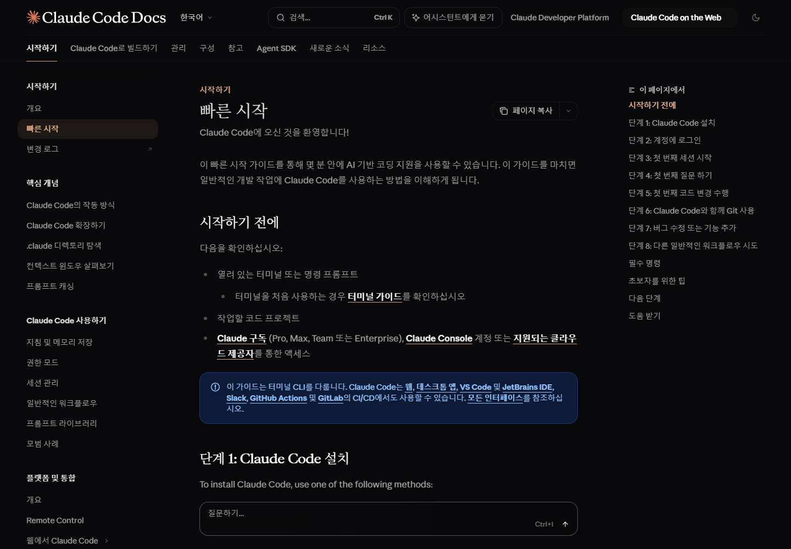

# 2차시 · 우리가 쓸 도구 지도

!!! note "이번 차시에 하는 일"
    - 우리가 쓸 **AI 코딩 도구 네 가지**가 각각 무엇인지 눈으로 봅니다
    - 왜 그중 **Claude Code**를 주로 쓰는지 이해합니다
    - **준비물·계정·비용**을 표로 정리하고, "5분 룰"을 배웁니다

> ⏱️ 걸리는 시간: 약 30분 · 🧰 준비물: 인터넷이 되는 컴퓨터 (구경만 합니다)

---

## 왜 이걸 하나요?

여행을 떠나기 전에 지도를 펴 보듯, 본격적으로 설치하기 전에 **우리가 쓸 도구들이 각각 뭔지** 한 번 구경해 둡니다. 이름이 낯설어도 괜찮습니다. 오늘은 "아, 이런 게 있구나" 정도만 알면 충분합니다. 실제 설치는 3마당에서 하나씩 천천히 합니다.

---

## AI 코딩 도구가 뭐예요?

**AI 코딩 도구(코딩 에이전트)** 란, 우리가 말로 부탁하면 그 코드를 대신 만들어 주는 프로그램입니다. 사람으로 치면 "내 옆에 앉은 프로그래머 비서"입니다. 우리는 이 비서에게 우리말로 부탁만 하면 됩니다.

이런 비서가 요즘 여러 회사에서 나와 있습니다. 이 책은 그중 **네 가지**를 다룹니다. 놀랍게도 **네 가지 모두 쓰는 방법이 거의 똑같습니다** — 설치하고, 로그인하고, 폴더에서 켜고, 우리말로 부탁한다. 그래서 하나만 제대로 익히면 나머지는 구경하듯 넘어갈 수 있습니다.

!!! abstract "📌 이 책의 약속 — 프롬프트는 어디서든 똑같이 통합니다"
    이 책에 나오는 **모든 부탁(프롬프트)** 은 네 도구 중 어디에 넣어도 똑같이 동작합니다. 그러니 "어떤 도구를 골라야 하지?" 하고 겁먹지 마세요. 우리는 **Claude Code**를 기준으로 설명하고, 나머지 셋은 "이런 것도 있다"고 설치만 구경합니다.

---

## 도구 ① Claude Code — 이 책의 주력 도구

**Claude Code**는 앤트로픽(Anthropic)이라는 회사가 만든 AI 코딩 도구입니다. 이 책은 이걸 **주로** 씁니다. 이유는 간단합니다 — 우리말(한국어)을 잘 알아듣고, 결과가 안정적이고, 초보자가 실수해도 항상 "이렇게 해도 될까요?" 하고 물어본 뒤에 움직이기 때문입니다.

<!-- FIG: id=c02-f01 | type=스크린샷 | src=capture | file=images/c02/c02-f01.png -->
> **그림 2.1 — Claude Code 공식 안내 페이지**
>
> *[캡처: code.claude.com/docs 한국어 시작 안내 화면.]*

Claude Code는 **검은 화면(터미널)에 글자로 부탁하는 방식**입니다. "검은 화면"이라는 말에 벌써 긴장되나요? 걱정 마세요. 사실 그 검은 화면은 **AI와 대화하는 채팅창**일 뿐이고, 우리는 거기에 우리말로 말만 하면 됩니다. 여는 법부터 3마당에서 그림으로 천천히 배웁니다.

!!! warning "⚠️ 조심 — Claude Code는 유료 구독이 필요합니다"
    Claude Code를 제대로 쓰려면 **유료 구독(Pro 이상)** 이 있어야 합니다. 무료 계정으로는 안 됩니다. 요금은 자주 바뀌니 **정확한 금액은 공식 사이트에서 확인**하세요(대략 월 3만원대). 돈을 아끼고 싶은 분은 아래 무료 도구들을 보세요.

---

## 도구 ②③④ — 무료로 구경해 볼 세 가지 (설치 갤러리)

Claude Code 말고도, 무료로 또는 이미 쓰던 계정으로 써볼 수 있는 도구가 있습니다. 3마당에서 하나씩 설치해 "같은 부탁을 넣으면 똑같이 되네?"를 직접 확인할 겁니다. 지금은 얼굴만 익혀 둡니다.

### ② Codex — 이미 챗GPT를 쓰고 있다면

**Codex**는 챗GPT를 만든 회사(OpenAI)의 코딩 도구입니다. **이미 챗GPT 유료 구독을 쓰고 있다면**, 추가 비용 없이 그 계정으로 로그인해 바로 쓸 수 있습니다. 사용 방식은 Claude Code와 똑같이 "검은 화면에 부탁하기"입니다.

<!-- FIG: id=c02-f02 | type=스크린샷 | src=capture | file=images/c02/c02-f02.png -->
> **그림 2.2 — Codex 공식 안내 페이지**
>
> *[캡처: OpenAI Codex 소개 페이지.]*

### ③ OpenCode — 여러 AI를 골라 쓰는 '만능 리모컨'

**OpenCode**는 누구나 무료로 내려받을 수 있는(오픈소스) 코딩 도구입니다. 특징은 **여러 회사의 AI를 골라서 연결**할 수 있다는 점입니다. TV 리모컨 하나로 여러 채널을 돌리듯, 이 도구 하나로 원하는 AI를 골라 씁니다.

<!-- FIG: id=c02-f03 | type=스크린샷 | src=capture | file=images/c02/c02-f03.png -->
> **그림 2.3 — OpenCode 공식 사이트**
>
> *[캡처: opencode.ai 첫 화면.]*

### ④ Antigravity — 검은 화면이 부담스럽다면

**Antigravity**는 구글이 만든 도구인데, 앞의 셋과 달리 **검은 화면이 아니라 버튼과 채팅창이 있는 프로그램 화면**입니다. 터미널이 영 부담스러운 분에게 눈이 편할 수 있습니다. 구글(지메일) 계정으로 로그인해 무료로 시작할 수 있습니다(무료 사용량 한도가 있습니다).

<!-- FIG: id=c02-f04 | type=스크린샷 | src=capture | status=pending | file=images/c02/c02-f04.png -->
> **그림 2.4 — Google Antigravity 공식 사이트**
>
> *[캡처 대기: antigravity.google 첫 화면. 애니메이션 사이트라 자동 캡처가 어려움 → 브라우저에서 쿠키 동의 후 직접 캡처 예정. (임시로 antigravity.google/download 또는 공식 codelabs 시작 페이지로 대체 가능)]*

| 도구 | 만든 곳 | 화면 방식 | 비용 | 한마디 |
|---|---|---|---|---|
| **Claude Code** | Anthropic | 검은 화면(터미널) | 유료(월 3만원대~) | **이 책의 주력** |
| Codex | OpenAI | 검은 화면(터미널) | 챗GPT 유료 계정이면 추가비용 X | 이미 챗GPT 쓰면 유리 |
| OpenCode | 오픈소스 | 검은 화면(터미널) | 무료(연결하는 AI에 따라) | 여러 AI 골라 쓰기 |
| Antigravity | Google | 프로그램 화면(버튼) | 무료(한도 있음) | 검은 화면이 싫다면 |

> **표 2.1 — AI 코딩 도구 4종 비교** (요금·한도는 변동되니 공식 사이트에서 확인)

---

## 게임을 만들 도구 — Expo, 그리고 엔진 Node.js

AI 코딩 도구(비서)가 실제로 게임을 만들 때, 뒤에서 쓰는 도구가 두 개 더 있습니다. **여러분이 직접 다룰 일은 거의 없고**, AI가 알아서 씁니다. 이름만 알아 둡니다.

- **Expo(엑스포)** — 앱과 게임을 만드는 도구입니다. 우리는 이걸로 **브라우저(인터넷 창)에서 도는** 리듬게임을 만듭니다.
- **Node.js(노드)** — 화면에 보이지 않는 **엔진**입니다. Claude Code와 Expo가 일하려면 이게 먼저 깔려 있어야 합니다. 5차시에서 딱 한 번 설치합니다.

<!-- FIG: id=c02-f05 | type=스크린샷 | src=capture | file=images/c02/c02-f05.png -->
> **그림 2.5 — Node.js 공식 다운로드 페이지 (5차시에서 여기서 내려받습니다)**
>
> *[캡처: nodejs.org 다운로드 페이지. 'LTS'라고 적힌 버튼이 보이게.]*

<!-- FIG: id=c02-f06 | type=스크린샷 | src=capture | file=images/c02/c02-f06.png -->
> **그림 2.6 — Expo 공식 문서 첫 화면 (우리 게임을 만들 도구)**
>
> *[캡처: docs.expo.dev 첫 화면.]*

!!! info "🔎 낱말 사전"
    - **Expo** — 앱·게임을 만드는 도구. 우리는 브라우저용 리듬게임을 이걸로 만듭니다.
    - **Node.js** — Claude Code와 Expo가 돌아가는 데 필요한 '엔진'. 한 번만 깔면 됩니다.
    - **LTS** — '오래 안정적으로 지원되는 버전'. Node.js를 받을 땐 늘 이걸 고릅니다.

---

## 준비물·비용 한눈에

| 항목 | 필요 여부 | 대략 비용 |
|---|---|---|
| 윈도우 컴퓨터 + 인터넷 | 필수 | (이미 있음) |
| Claude Code 구독 | 필수(주력) | 월 3만원대~ (공식 확인) |
| Codex / OpenCode / Antigravity | 선택(구경용) | 무료 또는 기존 계정 |
| Node.js · Expo | 필수(무료) | 0원 |
| 키링 키보드 (블루투스·방향키) | 5마당에서 사용 | 제품에 따라 다름 |

> **표 2.2 — 준비물과 비용** (돈 안 쓰고 시작하려면: 무료 도구 + 키링만)

---

## 막힐 때의 단 하나의 규칙 — "5분 룰"

이 책 전체에 걸쳐 딱 하나의 규칙이 있습니다.

!!! tip "💡 5분 룰"
    **5분 동안 안 되면, 화면에 뜬 글자를 그대로 복사해서 AI에게 붙여넣고 "이거 왜 이래요?"라고 물어보세요.**

    혼자 끙끙대지 마세요. 화면의 영어 오류 메시지를 이해할 필요도 없습니다. **그대로 복사 → AI에게 붙여넣기 → 물어보기.** 열에 일곱은 AI가 해결해 줍니다. 진짜 개발자들도 똑같이 합니다.

!!! success "✅ 이번 차시에서 꼭 가져갈 것"
    - ☐ AI 코딩 도구는 **4종**, 방식은 다 비슷하다 (설치→로그인→폴더서 켜기→우리말로 부탁)
    - ☐ 이 책의 주력은 **Claude Code**(유료), 나머지 셋은 구경용
    - ☐ 막히면 **5분 룰**

---

!!! abstract "📌 핵심 요약"
    - AI 코딩 도구 4종: **Claude Code(주력)** · Codex · OpenCode · Antigravity. 쓰는 법은 거의 같다.
    - **프롬프트는 어느 도구든 똑같이 통한다.**
    - 게임은 **Expo**로 만들고, 그 밑엔 엔진 **Node.js**가 필요하다(5차시 설치).
    - 요금·한도는 변하니 **공식 사이트 확인**. 막히면 **5분 룰**.

!!! question "🤔 혼자 해보기"
    Q1. 네 가지 도구 중, 나에게 가장 잘 맞을 것 같은 건 무엇인가요? 그 이유는? (정답 없음)

    ✍️ ________________________________________________

    Q2. 나는 이미 '챗GPT 유료 구독'이 있나요? 있다면 어떤 도구가 유리할까요?

    ✍️ ________________________________________________

!!! info "🔎 낱말 사전"
    - **코딩 에이전트(AI 코딩 도구)** — 말로 부탁하면 코드를 대신 만들어 주는 프로그램.
    - **터미널(검은 화면)** — 글자로 컴퓨터에 명령·부탁을 하는 창. 사실은 AI와의 채팅창.
    - **구독** — 매달 요금을 내고 쓰는 방식.

> **다음 차시 예고** — 3차시부터는 진짜로 손을 움직입니다. 먼저 그 "검은 화면(터미널)"을 열어 보고, 하나도 무섭지 않다는 걸 직접 확인합니다.
