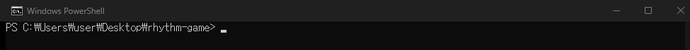
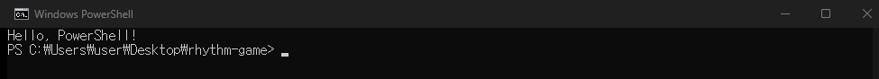

# 3차시 · 터미널이 무섭지 않아요

!!! note "이번 차시에 하는 일"
    - "검은 화면(터미널)"을 처음으로 직접 열어 봅니다
    - 지금 연 게 **파워셸(PowerShell)**이 맞는지 확인하는 법을 배웁니다
    - 터미널에 첫 명령을 한 줄 입력해, 컴퓨터가 대답하는 걸 경험합니다

> ⏱️ 걸리는 시간: 약 25분 · 🧰 준비물: 윈도우 컴퓨터

---

## 왜 이걸 하나요?

앞으로 AI에게 코딩을 시키려면, **"터미널"**이라는 창을 씁니다. 검은 바탕에 글자만 있는 화면이라 처음엔 낯설지만, 사실은 아주 단순합니다.

!!! tip "💡 터미널은 'AI와 대화하는 채팅창'입니다"
    카카오톡에 말풍선을 쓰듯, 터미널에는 **글자를 한 줄 쓰고 엔터**를 누릅니다. 그러면 컴퓨터(또는 AI)가 그 아래에 대답을 적어 줍니다. 마우스로 버튼을 누르는 대신 글자로 부탁하는 것, 그게 전부입니다.

!!! warning "⚠️ 조심 — 잘못 눌러도 컴퓨터는 고장 나지 않아요"
    처음이라 겁이 날 수 있지만, 명령을 잘못 쳐도 컴퓨터가 망가지지 않습니다. "그런 명령 없어요" 같은 안내만 뜰 뿐입니다. 편하게 눌러 보세요.

---

## 따라 하기

### 단계 ① 파워셸을 엽니다

키보드에서 **`Windows`키와 `X`키를 함께** 누르세요. 화면 왼쪽 아래에 목록이 뜨면 그중 **[터미널]** 또는 **[Windows PowerShell]**을 클릭합니다.

<!-- FIG: id=c03-f01 | type=스크린샷 | src=manual | status=todo | file=images/c03/c03-f01.png -->
> **그림 3.1 — `Windows`+`X` 메뉴에서 [터미널] 고르기**
>
> *[캡처 예정(저자): Win+X를 눌렀을 때 뜨는 메뉴. '터미널' 항목에 표시.]*

검은(또는 짙은) 창이 하나 열립니다. 이게 터미널입니다.

<!-- FIG: id=c03-f02 | type=스크린샷 | src=capture | file=images/c03/c03_ps_open.png -->
> **그림 3.2 — 처음 열린 파워셸 창**



### 단계 ② 파워셸이 맞는지 확인합니다

창 안, 글자가 시작되는 줄의 **맨 앞을 보세요.** `PS`라는 글자로 시작하면(예: `PS C:\Users\...>`) 제대로 **파워셸**을 연 것입니다.

!!! warning "⚠️ 조심 — `PS`가 없으면 다른 창입니다"
    맨 앞에 `PS`가 없이 `C:\Users\...>` 처럼만 보이면, 그건 파워셸이 아니라 옛날식 창(명령 프롬프트)입니다. 창을 닫고 단계 ①을 다시 해서 **[터미널]** 또는 **[Windows PowerShell]**을 고르세요. 이 책은 `PS`가 붙은 파워셸을 기준으로 진행합니다.

### 단계 ③ 첫 명령을 입력합니다

이제 컴퓨터에게 처음으로 말을 걸어 봅니다. 창 안을 한 번 클릭한 뒤, 아래 글자를 그대로 타이핑하고 **엔터**를 누르세요.

!!! quote "🗣️ 이대로 입력해 보세요"
    ```
    Write-Output "Hello, PowerShell!"
    ```

그러면 바로 아랫줄에 여러분이 쓴 말이 그대로 나옵니다. 컴퓨터가 대답한 것입니다.

<!-- FIG: id=c03-f03 | type=스크린샷 | src=capture | file=images/c03/c03_ps_help.png -->
> **그림 3.3 — 첫 명령의 결과 — 컴퓨터가 대답했습니다**



!!! tip "💡 마우스가 아니라 키보드로"
    터미널 안에서는 글자를 마우스로 클릭해도 아무 일도 없습니다. **키보드**로 타이핑하고 **엔터**로 실행하는 곳이라고 기억하세요. (붙여넣기는 창 안에서 마우스 오른쪽 클릭이면 됩니다.)

---

!!! success "✅ 여기까지 됐으면"
    - ☐ 검은 터미널 창을 **직접 열었다**
    - ☐ 맨 앞에 **`PS`**가 있는 걸 확인했다
    - ☐ 첫 명령을 입력해 **컴퓨터의 대답**을 봤다

!!! abstract "📌 핵심 요약"
    - 터미널은 **글자로 컴퓨터에 부탁하는 창** — AI와 대화하는 채팅창이다.
    - 연 다음 **맨 앞 `PS`**로 파워셸인지 확인한다.
    - **타이핑 → 엔터**가 기본. 잘못 쳐도 고장 나지 않는다.

!!! question "🤔 혼자 해보기"
    Q. 터미널 창 맨 앞에 무엇이 보이면 '파워셸'이 맞나요?

    ✍️ ________________________________________________

!!! info "🔎 낱말 사전"
    - **터미널** — 글자로 컴퓨터에 명령·부탁을 하는 창.
    - **파워셸(PowerShell)** — 윈도우 기본 터미널. 맨 앞에 `PS`가 붙는다.
    - **명령 프롬프트(CMD)** — 옛날식 터미널. `PS`가 없다. 이 책에서는 쓰지 않는다.
    - **엔터(Enter)** — 입력한 줄을 '실행'하는 키.

> **다음 차시 예고** — 4차시에서는 게임을 만들 **작업 폴더**를 바탕화면에 만들고, "경로(주소)"가 무엇인지 익힙니다.
