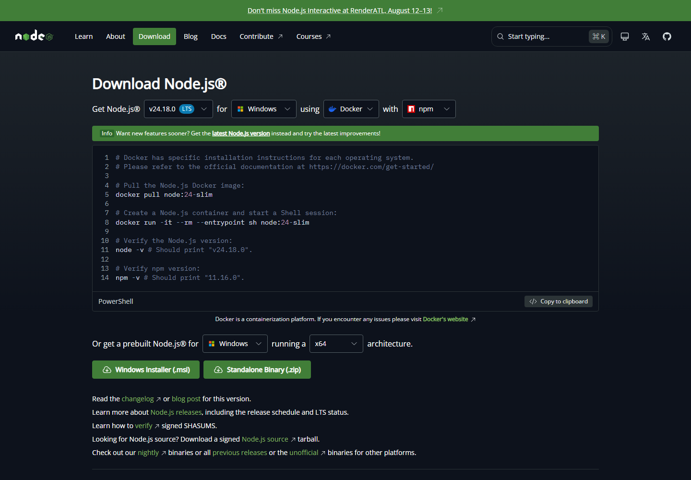
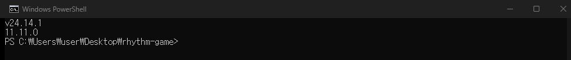

# 5차시 · Node.js 설치하기

!!! note "이번 차시에 하는 일"
    - AI 도구와 게임이 돌아가는 **엔진, Node.js**를 설치합니다
    - 공식 사이트에서 **LTS(안정 버전)**를 내려받아 설치합니다
    - 설치가 잘 됐는지 터미널에서 **한 줄로 확인**합니다

> ⏱️ 걸리는 시간: 약 20분 · 🧰 준비물: 인터넷, 터미널

---

## 왜 이걸 하나요?

우리가 쓸 **Claude Code**와, 게임을 만들 **Expo**는 둘 다 **Node.js**라는 프로그램 위에서 움직입니다. 자동차로 치면 **엔진**입니다. 눈에 보이진 않지만, 이게 없으면 도구들이 시동이 안 걸립니다. 한 번만 설치해 두면 됩니다.

---

## 따라 하기

### 단계 ① 공식 사이트에 들어갑니다

인터넷 창(크롬 등)에서 **`nodejs.org`** 로 접속합니다. 아래와 같은 다운로드 화면이 나옵니다.

<!-- FIG: id=c05-f01 | type=스크린샷 | src=capture | file=images/c02/c02-f05.png -->
> **그림 5.1 — Node.js 공식 다운로드 페이지 (`nodejs.org`)**



### 단계 ② 'LTS'라고 적힌 것을 내려받습니다

버전이 두 종류 보이면, 반드시 **`LTS`**(오래 안정적으로 지원되는 버전)라고 적힌 쪽을 고릅니다. 화면의 **[Windows Installer (.msi)]** 버튼을 눌러 설치 파일을 내려받으세요.

!!! warning "⚠️ 조심 — 'Current'가 아니라 'LTS'"
    옆에 'Current(최신 실험 버전)'가 있어도 우리는 **LTS**를 씁니다. 버전 번호(예: 24.x)는 계속 바뀌니 숫자는 신경 쓰지 말고 **`LTS` 글자**만 보고 고르면 됩니다.

### 단계 ③ 설치 파일을 실행하고 '다음'만 누릅니다

내려받은 `.msi` 파일을 더블클릭합니다. 설치 마법사가 뜨면 **거의 다 [Next(다음)]**만 누르면 됩니다. (동의 체크 → 다음 → 다음 → **[Install]** → 마지막에 **[Finish]**.) 중간에 "이 앱이 장치를 변경하도록 허용할까요?"가 뜨면 **[예]**를 누릅니다.

<!-- FIG: id=c05-f02 | type=스크린샷 | src=blog | status=todo | file=images/c05/c05-f02.png -->
> **그림 5.2 — Node.js 설치 마법사 (Next → Next → Install → Finish)**
>
> *[캡처 예정: 설치 마법사 각 단계. 참고 소스 — urmaru.com/9(설치 11컷). 저자 재캡처 또는 출처표기 후 사용.]*

### 단계 ④ 설치를 확인합니다 (중요)

설치가 끝나면 **터미널을 새로 여세요.** (이미 열려 있던 터미널은 설치를 모릅니다 — 꼭 새 창!) 그리고 아래를 입력합니다.

!!! quote "🗣️ 이대로 입력해 보세요"
    ```
    node -v
    npm -v
    ```

아래 그림처럼 **버전 번호 두 줄**(예: `v24.x.x`, `11.x.x`)이 나오면 설치 성공입니다.

<!-- FIG: id=c05-f03 | type=스크린샷 | src=capture | file=images/c05/c05_node_check.png -->
> **그림 5.3 — `node -v` / `npm -v` 로 설치 확인 — 버전이 나오면 성공**



!!! warning "⚠️ 조심 — '인식할 수 없는 명령'이 뜬다면"
    십중팔구 **설치 후 터미널을 새로 안 열어서**입니다. 열려 있던 창을 닫고 **새 파워셸**을 연 뒤 `node -v`를 다시 해 보세요.

---

!!! success "✅ 여기까지 됐으면"
    - ☐ `nodejs.org`에서 **LTS** 설치 파일을 받았다
    - ☐ 마법사를 **다음→다음→설치→마침**으로 끝냈다
    - ☐ 새 터미널에서 `node -v` / `npm -v` 로 **버전 두 줄**을 확인했다

!!! abstract "📌 핵심 요약"
    - Node.js는 도구들이 돌아가는 **엔진**. 한 번만 설치.
    - 반드시 **LTS** 버전, **Windows Installer(.msi)**.
    - 확인은 **새 터미널**에서 `node -v` / `npm -v`.

!!! question "🤔 혼자 해보기"
    Q. `node -v`가 "인식할 수 없는 명령"이라고 나올 때 가장 먼저 해볼 일은?

    ✍️ ________________________________________________

!!! info "🔎 낱말 사전"
    - **Node.js** — Claude Code·Expo가 돌아가는 엔진 프로그램.
    - **LTS** — 오래 안정적으로 지원되는 버전. 받을 때 이걸 고른다.
    - **npm** — Node.js와 함께 깔리는, 부품을 자동으로 받아 주는 도구.
    - **`node -v`** — 설치된 Node.js 버전을 보여 주는 확인 명령.

> **다음 차시 예고** — 6차시에서 드디어 주력 도구 **Claude Code**를 설치하고, AI에게 첫 부탁을 건넵니다.
