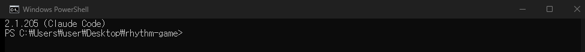

# 6차시 · Claude Code 설치와 첫 대화

!!! note "이번 차시에 하는 일"
    - 주력 도구 **Claude Code**를 설치합니다 (명령 한 줄)
    - 브라우저로 **로그인**해 내 컴퓨터와 연결합니다
    - AI에게 **첫 부탁(프롬프트)**을 우리말로 건넵니다

> ⏱️ 걸리는 시간: 약 30분 · 🧰 준비물: 터미널, Claude 유료 구독(Pro 이상)

---

## 왜 이걸 하나요?

지금까지는 준비 운동이었습니다. 이제 **내 컴퓨터에 AI 개발자를 데려옵니다.** Claude Code를 설치하면, 터미널 창이 곧 **AI와 대화하는 채팅창**이 됩니다. 우리말로 "이런 거 만들어 줘"라고 하면 AI가 코드를 만들어 줍니다.

!!! warning "⚠️ 조심 — 먼저 유료 구독이 필요합니다"
    Claude Code는 **무료 계정으로는 쓸 수 없고**, 최소 **Pro 구독**(대략 월 3만원대)이 있어야 합니다. 요금은 자주 바뀌니 정확한 금액은 공식 사이트(`claude.com`)에서 확인하세요. 아직 구독이 없다면 먼저 가입해 두고 오세요.

---

## 따라 하기

### 단계 ① 설치 명령을 붙여넣습니다

파워셸(3차시에서 연 그 검은 창)을 엽니다. 맨 앞에 **`PS`**가 있는지 다시 확인하세요. 그리고 아래 한 줄을 **그대로 복사해 붙여넣고** 엔터를 누릅니다.

!!! quote "🗣️ 이대로 복사해서 붙여넣으세요"
    ```
    irm https://claude.ai/install.ps1 | iex
    ```

글자들이 주르륵 지나가다가 **`Claude Code successfully installed!`** 비슷한 문구가 나오면 설치 성공입니다.

<!-- FIG: id=c06-f01 | type=스크린샷 | src=web | file=images/c02/c02-f01.png -->
> **그림 6.1 — Claude Code 공식 시작 안내 (`code.claude.com/docs`)**


!!! warning "⚠️ 조심 — `irm이 인식되지 않습니다`가 뜨면"
    파워셸이 아니라 옛날 창(CMD)에 붙여넣은 것입니다. 창을 닫고 3차시대로 **[터미널/Windows PowerShell]**을 다시 여세요(맨 앞 `PS` 확인).

### 단계 ② 작업 폴더에서 Claude Code를 켭니다

4차시에서 만든 폴더로 이동한 뒤 `claude`라고 입력해 실행합니다.

!!! quote "🗣️ 이대로 입력해 보세요"
    ```
    cd $HOME\Desktop\rhythm-game
    claude
    ```

### 단계 ③ 브라우저로 로그인합니다

`claude`를 처음 실행하면 **인터넷 창이 자동으로 열립니다.** 거기서 내 Claude 계정으로 로그인하면, 터미널로 자동으로 돌아와 연결이 끝납니다.

<!-- FIG: id=c06-f02 | type=스크린샷 | src=manual | status=todo | file=images/c06/c06-f02.png -->
> **그림 6.2 — 첫 실행 시 열리는 로그인 화면**
>
> *[캡처 예정(저자): claude 최초 실행 → 브라우저 로그인 화면. 개인정보(계정) 가린 상태로.]*

### 단계 ④ 설치를 확인합니다

연결이 끝났으면, 제대로 깔렸는지 버전을 확인해 봅니다. (터미널에서 Claude Code를 잠깐 빠져나오려면 `/exit` 입력.)

!!! quote "🗣️ 이대로 입력해 보세요"
    ```
    claude --version
    ```

<!-- FIG: id=c06-f03 | type=스크린샷 | src=capture | file=images/c06/c06_claude_version.png -->
> **그림 6.3 — `claude --version` — 버전이 나오면 설치 완료**



### 단계 ⑤ AI에게 첫 부탁을 건넵니다

이제 진짜입니다. `claude`를 실행한 상태에서, 아래처럼 **우리말로 그냥 부탁**해 보세요.

!!! quote "🗣️ 이대로 복사해서 붙여넣으세요 (AI에게 하는 말)"
    ```
    안녕! 지금 이 폴더에 리듬게임을 만들 거야.
    먼저 이 폴더에 어떤 것들이 있는지 살펴보고,
    앞으로 뭘 하면 좋을지 한국어로 쉽게 알려줘.
    ```

AI가 폴더를 살펴보고 한국어로 대답해 줄 것입니다. 파일을 만들거나 고치기 전에는 항상 **"이렇게 해도 될까요?"**라고 물어보니, 괜찮으면 엔터(승인)만 누르면 됩니다.

!!! tip "💡 말은 편하게 — 프롬프트 기술 필요 없음"
    문장을 예쁘게 다듬을 필요 없습니다. 친구에게 부탁하듯 말하면 됩니다. 마음에 안 들면 "좀 더 쉽게 설명해 줘", "다시 해 줘"라고 이어서 말하면 됩니다.

---

!!! success "✅ 여기까지 됐으면"
    - ☐ `irm ... | iex` 한 줄로 **Claude Code를 설치**했다
    - ☐ 브라우저 **로그인**으로 연결했다
    - ☐ `claude --version`으로 확인하고, **첫 부탁**을 우리말로 건넸다

!!! abstract "📌 핵심 요약"
    - 설치는 파워셸에 **`irm https://claude.ai/install.ps1 | iex`** 한 줄.
    - 첫 실행 시 **브라우저 로그인**(무료 계정 X, Pro 이상 필요).
    - 작업 폴더에서 `claude` 실행 → **우리말로 부탁**하면 끝. 승인은 엔터.

!!! question "🤔 혼자 해보기"
    Q. Claude Code를 설치하기 전에 반드시 준비해 두어야 하는 것은 무엇인가요?

    ✍️ ________________________________________________

!!! info "🔎 낱말 사전"
    - **Claude Code** — 이 책의 주력 AI 코딩 도구.
    - **`irm ... | iex`** — 설치 스크립트를 받아 실행하는 파워셸 한 줄 명령.
    - **로그인(브라우저 인증)** — 내 계정과 터미널을 잇는 과정.
    - **승인** — AI가 파일을 바꾸기 전 묻는 확인. 괜찮으면 엔터.

> **다음 차시 예고** — 다음 3마당에서는 Claude Code 말고도 **Codex·OpenCode·Antigravity**를 하나씩 설치해 보고, "프롬프트는 어디서든 똑같이 통한다"를 직접 확인합니다.
