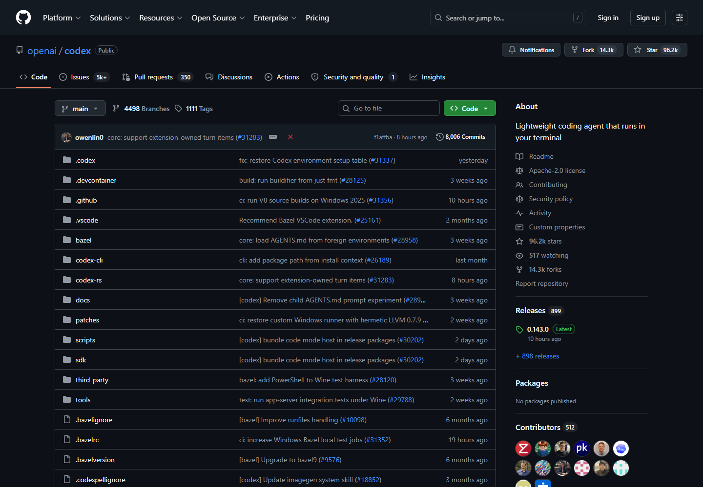

# 8차시 · 갤러리① Codex — 챗GPT 계정으로 바로 쓰는 AI 코딩 도구

!!! note "이번 차시에 하는 일"
    - **Codex**(OpenAI의 AI 코딩 도구)를 설치합니다
    - 이미 쓰고 있는 **챗GPT 계정으로 로그인**합니다
    - 6차시와 **똑같은 부탁(프롬프트)**을 건네서, 도구가 달라도 통하는지 확인합니다

> ⏱️ 걸리는 시간: 약 20분 · 🧰 준비물: 터미널, 챗GPT 유료 구독(있으면 추가 비용 없음)

---

## 왜 이걸 하나요?

지금까지 우리는 Claude Code 하나만 써 봤습니다. 그런데 AI에게 코딩을 시키는 도구는 Claude Code만 있는 게 아닙니다. **Codex**는 챗GPT를 만든 회사(OpenAI)가 만든 도구입니다. 이미 챗GPT 유료 구독(Plus/Pro 등)을 쓰고 있다면, **새로 돈을 내지 않고 그 계정으로 로그인해 바로 씁니다.**

이번 차시의 진짜 목적은 설치 자체가 아니라 이것을 눈으로 확인하는 데 있습니다. **도구 이름만 바뀌었을 뿐, 부탁하는 방식(프롬프트)은 6차시와 똑같습니다.** "검은 화면에 우리말로 부탁하면 AI가 알아듣는다"는 원리는 어느 도구든 같습니다.

!!! warning "⚠️ 조심 — 이 도구는 가상 갤러리입니다"
    여기 소개되는 **Codex**(및 설치 명령)는 챗GPT 계정을 활용하는 AI 코딩 도구의 작동 방식을 시각적으로 보여주기 위해 구성된 **가상 갤러리(예시 흐름)**입니다. 실제로 개인 컴퓨터에 설치 및 실행이 되지 않을 수 있으므로, 직접 실습을 따라 하시기보다는 **"이런 AI 도구도 있고, 부탁하는 방법(프롬프트)은 다 똑같이 통하는구나"** 하고 화면을 눈으로 확인하며 가볍게 읽어 보시는 것을 권장합니다.

!!! tip "💡 이미 챗GPT를 쓰고 있다면"
    Codex는 챗GPT 유료 구독에 포함되어 제공되는 경우가 많습니다. 정확히 어떤 구독 등급에서 얼마나 쓸 수 있는지는 자주 바뀌므로, 정확한 내용은 공식 사이트(`chatgpt.com`, `openai.com`)에서 확인하세요. 챗GPT 계정이 아예 없다면 먼저 무료로 가입만 해 두어도 로그인 자체는 됩니다(사용량은 별개).

---

## 따라 하기

### 단계 ① 설치 명령을 붙여넣습니다

파워셸을 엽니다(맨 앞 `PS` 확인). 5차시에서 설치해 둔 Node.js가 이번에도 필요합니다. 아래 한 줄을 **그대로 복사해 붙여넣고** 엔터를 누릅니다.

!!! quote "🗣️ 이대로 복사해서 붙여넣으세요"
    ```
    npm install -g @openai/codex
    ```

글자가 주르륵 지나가고 설치가 끝나면 성공입니다.

<!-- FIG: id=c08-f01 | type=스크린샷 | src=capture | file=images/c02/c02-f02.png -->
> **그림 8.1 — Codex 공식 안내 페이지 (OpenAI)**



<!-- FIG: id=c08-f02 | type=스크린샷 | src=manual | status=todo | file=images/c08/c08-f02.png -->
> **그림 8.2 — 설치 명령 실행 후 터미널 화면**
>
> *[캡처 예정(저자): `npm install -g @openai/codex` 실행 후 완료 문구가 뜬 파워셸 화면.]*

!!! warning "⚠️ 조심 — 두 도구를 동시에 켜 두어도 괜찮습니다"
    Claude Code를 쓰던 창을 굳이 끄지 않아도 됩니다. 터미널 창을 **하나 더 새로 열어서** 그 창에서 Codex를 설치·실행하면 됩니다. 두 도구가 서로 부딪히지 않습니다.

### 단계 ② 작업 폴더에서 Codex를 켭니다

내 프로젝트 폴더로 이동한 뒤 `codex`라고 입력해 실행합니다.

!!! quote "🗣️ 이대로 입력해 보세요"
    ```
    cd $HOME\Desktop\rhythm-game
    codex
    ```

<!-- FIG: id=c08-f03 | type=스크린샷 | src=manual | status=todo | file=images/c08/c08-f03.png -->
> **그림 8.3 — `codex` 첫 실행 화면**
>
> *[캡처 예정(저자): 작업 폴더에서 codex 최초 실행 시 뜨는 안내/메뉴 화면.]*

### 단계 ③ 챗GPT 계정으로 로그인합니다

처음 실행하면 로그인 방법을 고르라는 메뉴가 뜹니다. **[Sign in with ChatGPT]**(챗GPT로 로그인) 같은 항목을 고르면, 인터넷 창이 자동으로 열립니다. 거기서 내 챗GPT 계정으로 로그인하면 터미널로 자동으로 돌아옵니다.

<!-- FIG: id=c08-f04 | type=스크린샷 | src=manual | status=todo | file=images/c08/c08-f04.png -->
> **그림 8.4 — 로그인 방법을 고르는 화면**
>
> *[캡처 예정(저자): "Sign in with ChatGPT" 등 로그인 선택 메뉴. 개인정보 가린 상태로.]*

<!-- FIG: id=c08-f05 | type=스크린샷 | src=manual | status=todo | file=images/c08/c08-f05.png -->
> **그림 8.5 — 로그인 완료 후 터미널로 돌아온 화면**
>
> *[캡처 예정(저자): 로그인 성공 후 codex가 준비된 상태.]*

!!! warning "⚠️ 조심 — 로그인이 안 열리면"
    회사·공용 와이파이에서는 방화벽 때문에 로그인 창이 안 열릴 수 있습니다. 집 와이파이나 휴대폰 테더링으로 바꿔서 다시 시도해 보세요.

### 단계 ④ 6차시와 똑같은 부탁을 건네 봅니다

이제 핵심입니다. 6차시에서 Claude Code에게 건넸던 **그 말 그대로**를 Codex에게도 건네 보세요.

!!! quote "🗣️ 이대로 복사해서 붙여넣으세요 (AI에게 하는 말)"
    ```
    안녕! 지금 이 폴더에 리듬게임을 만들 거야.
    먼저 이 폴더에 어떤 것들이 있는지 살펴보고,
    앞으로 뭘 하면 좋을지 한국어로 쉽게 알려줘.
    ```

<!-- FIG: id=c08-f06 | type=스크린샷 | src=manual | status=todo | file=images/c08/c08-f06.png -->
> **그림 8.6 — Codex가 한국어로 답하는 화면**
>
> *[캡처 예정(저자): 같은 프롬프트에 Codex가 폴더를 살펴보고 답하는 화면.]*

도구 이름과 화면 색깔만 다를 뿐, **"우리말로 부탁 → AI가 알아듣고 답한다"**는 흐름은 완전히 같습니다. 이게 이번 차시에서 확인하고 싶었던 전부입니다.

---

!!! tip "💡 Claude Code랑 뭐가 다른가요?"
    큰 틀은 같지만 세부 화면 구성, 승인받는 문구, 무료/유료 기준이 조금씩 다릅니다. 이 책은 본문 실습을 Claude Code로 계속 진행하니, Codex는 "다른 도구도 이렇게 통하는구나"를 확인하는 갤러리로만 써 보면 충분합니다.

!!! success "✅ 여기까지 됐으면"
    - ☐ `npm install -g @openai/codex`로 **Codex를 설치**했다
    - ☐ 챗GPT 계정으로 **로그인**해 연결했다
    - ☐ 6차시와 **같은 부탁**을 건네 한국어로 답을 받았다

!!! abstract "📌 핵심 요약"
    - Codex는 **OpenAI가 만든 AI 코딩 도구**, 이미 챗GPT 유료 구독이 있으면 추가 비용 없이 로그인해 쓴다.
    - 설치는 `npm install -g @openai/codex`, 실행은 `codex`.
    - 첫 실행 시 **챗GPT 계정으로 로그인**하면 끝.
    - **6차시와 똑같은 프롬프트**로도 똑같이 통한다 — "프롬프트는 어느 도구든 똑같이 통한다."

!!! question "🤔 혼자 해보기"
    Q. 이미 챗GPT 유료 구독을 쓰고 있다면, Codex를 쓸 때 새로 돈을 내야 할까요?

    ✍️ ________________________________________________

!!! info "🔎 낱말 사전"
    - **Codex** — OpenAI(챗GPT를 만든 회사)의 AI 코딩 도구.
    - **챗GPT 계정 로그인** — 이미 쓰던 챗GPT 계정으로 Codex와 연결하는 과정.
    - **`npm install -g`** — 컴퓨터 어디서든 쓸 수 있게 프로그램을 설치하는 명령.

> **다음 차시 예고** — 다음은 **OpenCode**입니다. 오픈소스로 누구나 무료로 받을 수 있고, 여러 회사의 AI 중 원하는 것을 골라 연결하는 "만능 리모컨" 같은 도구입니다.
