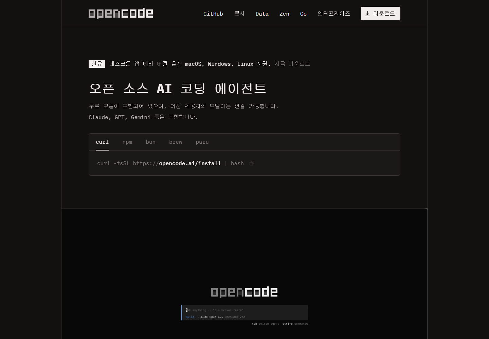

# 9차시 · 갤러리② OpenCode — 여러 AI를 골라 쓰는 만능 리모컨

!!! note "이번 차시에 하는 일"
    - **OpenCode**(오픈소스 AI 코딩 도구)를 설치합니다
    - `/connect`로 **원하는 AI를 골라 연결**합니다
    - 다시 한번 **같은 부탁(프롬프트)**을 건네서 통하는지 확인합니다

> ⏱️ 걸리는 시간: 약 25분 · 🧰 준비물: 터미널, 연결할 AI 계정 1개(선택)

---

## 왜 이걸 하나요?

**OpenCode**는 특정 회사가 아니라 누구나 무료로 내려받을 수 있는(오픈소스) 도구입니다. 가장 큰 특징은, 이 도구 자체가 AI를 만드는 게 아니라 **여러 회사의 AI 중 원하는 것을 골라서 연결**해 쓴다는 점입니다. TV 리모컨 하나로 여러 채널을 돌리듯, OpenCode 하나로 이런저런 AI를 갈아 끼워 쓸 수 있습니다.

이번 차시에서도 목적은 같습니다. 도구도 다르고, 연결하는 AI도 다르지만, **부탁하는 방식(프롬프트)은 똑같이 통한다**는 것을 다시 한번 확인합니다.

!!! warning "⚠️ 조심 — 내 Claude 계정 로그인 정보를 여기에 넣지 마세요"
    OpenCode는 여러 AI를 연결할 수 있다 보니, "쓰던 Claude 계정 로그인 정보를 그대로 넣으면 되지 않을까?"라는 생각이 들 수 있습니다. **그렇게 하지 마세요.** 각 AI 회사는 자기 회사가 만든 공식 프로그램(Claude라면 Claude Code) 밖의 다른 프로그램에 개인 로그인을 연결하는 것을 약관 위반으로 볼 수 있고, 심하면 계정이 정지될 수 있다는 사례도 있습니다. OpenCode에 뭔가를 연결할 때는 **그 도구 자체가 화면에서 안내하는 방법**(자체 로그인, 또는 발급받은 열쇠 입력)만 그대로 따르세요.

---

## 따라 하기

### 단계 ① 설치 명령을 붙여넣습니다

파워셸을 엽니다(맨 앞 `PS` 확인). 아래 한 줄을 **그대로 복사해 붙여넣고** 엔터를 누릅니다.

!!! quote "🗣️ 이대로 복사해서 붙여넣으세요"
    ```
    npm install -g opencode-ai
    ```

<!-- FIG: id=c09-f01 | type=스크린샷 | src=capture | file=images/c02/c02-f03.png -->
> **그림 9.1 — OpenCode 공식 사이트**



<!-- FIG: id=c09-f02 | type=스크린샷 | src=manual | status=todo | file=images/c09/c09-f02.png -->
> **그림 9.2 — 설치 명령 실행 후 터미널 화면**
>
> *[캡처 예정(저자): `npm install -g opencode-ai` 실행 후 완료 문구가 뜬 파워셸 화면.]*

### 단계 ② 작업 폴더에서 OpenCode를 켭니다

내 프로젝트 폴더로 이동한 뒤 `opencode`라고 입력해 실행합니다.

!!! quote "🗣️ 이대로 입력해 보세요"
    ```
    cd $HOME\Desktop\rhythm-game
    opencode
    ```

<!-- FIG: id=c09-f03 | type=스크린샷 | src=manual | status=todo | file=images/c09/c09-f03.png -->
> **그림 9.3 — `opencode` 첫 실행 화면**
>
> *[캡처 예정(저자): 작업 폴더에서 opencode 최초 실행 시 뜨는 화면.]*

### 단계 ③ `/connect`로 연결할 AI를 고릅니다

화면 아래 채팅창에 `/connect`라고 입력하면, 연결할 수 있는 AI 목록이 죽 나옵니다.

!!! quote "🗣️ 이대로 입력해 보세요"
    ```
    /connect
    ```

<!-- FIG: id=c09-f04 | type=스크린샷 | src=manual | status=todo | file=images/c09/c09-f04.png -->
> **그림 9.4 — `/connect` 입력 시 나오는 AI 목록**
>
> *[캡처 예정(저자): /connect 실행 후 연결 가능한 AI 회사·모델 목록 화면.]*

목록에서 원하는 것을 화살표로 고르고 엔터를 누릅니다. 그 다음부터는 **그 AI가 직접 안내하는 방식**(자체 로그인 창, 또는 화면에 나온 주소로 가서 열쇠를 발급받아 붙여넣기)을 그대로 따르면 됩니다.

<!-- FIG: id=c09-f05 | type=스크린샷 | src=manual | status=todo | file=images/c09/c09-f05.png -->
> **그림 9.5 — AI 연결이 끝난 화면**
>
> *[캡처 예정(저자): 연결 완료 표시(체크 표시 등)가 뜬 화면.]*

!!! tip "💡 뭘 골라야 할지 모르겠다면"
    목록 화면에 각 항목마다 "무료로 조금 써볼 수 있음" 같은 안내가 함께 뜨는 경우가 많습니다. 처음이라면 그런 무료 사용량이 있는 항목으로 먼저 연결해 보세요. 요금·무료 한도는 자주 바뀌므로 화면에 뜨는 안내를 그대로 확인하는 것이 가장 정확합니다.

### 단계 ④ 6차시와 똑같은 부탁을 건네 봅니다

연결이 끝났으면, 이번에도 그 말 그대로 건네 봅니다.

!!! quote "🗣️ 이대로 복사해서 붙여넣으세요 (AI에게 하는 말)"
    ```
    안녕! 지금 이 폴더에 리듬게임을 만들 거야.
    먼저 이 폴더에 어떤 것들이 있는지 살펴보고,
    앞으로 뭘 하면 좋을지 한국어로 쉽게 알려줘.
    ```

<!-- FIG: id=c09-f06 | type=스크린샷 | src=manual | status=todo | file=images/c09/c09-f06.png -->
> **그림 9.6 — OpenCode가 한국어로 답하는 화면**
>
> *[캡처 예정(저자): 같은 프롬프트에 연결된 AI가 폴더를 살펴보고 답하는 화면.]*

연결한 AI 회사가 무엇이든, 부탁하는 문장은 하나도 바꾸지 않았습니다. **프롬프트는 도구를 갈아 끼워도 그대로 통합니다.**

---

!!! warning "⚠️ 조심 — 답변 말투나 속도는 조금씩 다를 수 있어요"
    어떤 AI를 연결했는지에 따라 답이 오는 속도, 말투, 자세함 정도가 조금씩 다를 수 있습니다. 정상입니다. 마음에 안 들면 `/connect`로 다른 AI로 바꿔서 다시 시도해 보면 됩니다.

!!! success "✅ 여기까지 됐으면"
    - ☐ `npm install -g opencode-ai`로 **OpenCode를 설치**했다
    - ☐ `/connect`로 **원하는 AI를 골라 연결**했다(내 Claude 로그인 정보는 넣지 않았다)
    - ☐ 6차시와 **같은 부탁**을 건네 한국어로 답을 받았다

!!! abstract "📌 핵심 요약"
    - OpenCode는 **오픈소스**이고, 그 자체는 AI를 만들지 않는다 — **여러 AI를 골라 연결**해 쓰는 리모컨 같은 도구.
    - 설치는 `npm install -g opencode-ai`, 실행은 `opencode`.
    - `/connect`로 목록을 보고 원하는 AI를 골라, **그 AI 자체가 안내하는 방식**으로 연결한다.
    - **내 Claude 계정 로그인 정보는 여기 넣지 않는다** — 계정 정지 위험.
    - 무엇을 연결하든 **프롬프트는 똑같이 통한다.**

!!! question "🤔 혼자 해보기"
    Q. OpenCode에 AI를 연결할 때, 왜 내가 쓰던 Claude 계정 로그인 정보를 그대로 넣으면 안 될까요?

    ✍️ ________________________________________________

!!! info "🔎 낱말 사전"
    - **OpenCode** — 오픈소스 AI 코딩 도구. 여러 회사의 AI를 골라 연결해 쓴다.
    - **오픈소스** — 만든 방법(코드)이 공개되어 있어 누구나 무료로 받아 쓸 수 있는 소프트웨어.
    - **`/connect`** — OpenCode 안에서 연결할 AI를 고르는 명령.
    - **API 키(열쇠)** — 어떤 AI 서비스를 프로그램에서 쓰게 허락해 주는 긴 문자열 비밀번호 같은 것.

> **다음 차시 예고** — 다음은 갤러리 마지막, **Antigravity**입니다. 구글이 만든 도구로, 검은 화면이 아니라 버튼과 채팅창이 있는 프로그램에서 구글 계정으로 로그인해 씁니다.
