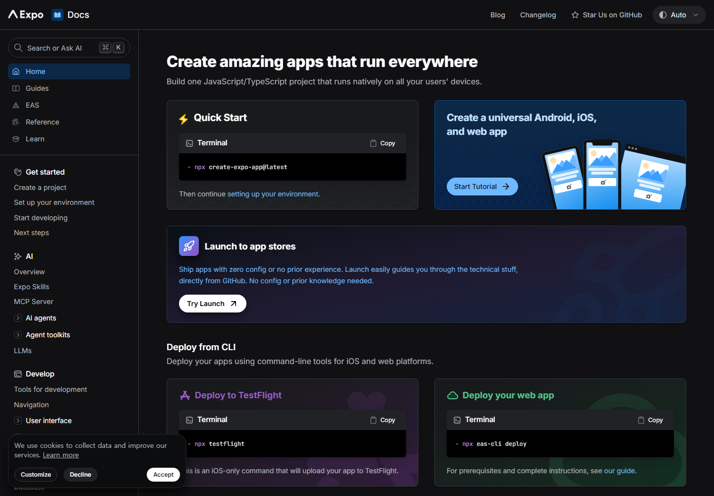

# 11차시 · 첫 프로젝트 "리듬게임 만들어줘"

!!! note "이번 차시에 하는 일"
    - Claude Code에게 **"리듬게임 만들어줘"** 라고 첫 부탁을 건넵니다
    - `npx expo start --web` 명령으로 **내 게임을 브라우저에서 처음** 켜 봅니다
    - 제목·PLAY 버튼·방향키 안내가 뜨는 **시작 화면**을 눈으로 확인합니다

> ⏱️ 걸리는 시간: 약 40분 · 🧰 준비물: Claude Code(6차시에서 설치), 터미널, 인터넷

---

## 왜 이걸 하나요?

여기까지 오시느라 고생하셨습니다. 지금까지는 전부 **준비 운동**이었습니다. 컴퓨터랑 친해지고, 도구들을 깔았습니다. 이제 진짜 **4마당 — 게임 만들기**가 시작됩니다.

가장 신기한 순간은 바로 지금입니다. 우리는 **코드를 한 글자도 쓰지 않습니다.** 그냥 Claude Code에게 "리듬게임을 만들어 달라"고 우리말로 부탁하면, AI가 필요한 부품(파일)들을 알아서 만들어 줍니다. 그리고 잠시 뒤, **내 컴퓨터의 인터넷 창(브라우저)**에 진짜로 게임 화면이 뜹니다. 씨앗을 심으면 새싹이 돋는 것과 비슷합니다.

<!-- FIG: id=c11-f01 | type=스크린샷 | src=capture | file=images/c02/c02-f06.png -->
> **그림 11.1 — Expo 공식 문서 (우리 게임을 만들어 줄 도구, 2차시에서 본 그 화면)**



우리가 만들 게임은 **Expo(엑스포)** 라는 도구로 만들어지고, **브라우저에서 도는 웹 게임**입니다. 앱스토어에 올리거나 설치할 필요가 전혀 없습니다. 명령 한 줄이면 바로 켜집니다.

---

## 따라 하기

### 단계 ① 작업 폴더에서 Claude Code를 켭니다

6차시에서 만들었던 그 작업 폴더로 갑니다. 파워셸을 열고 아래처럼 입력합니다.

!!! quote "🗣️ 이대로 입력해 보세요"
    ```
    cd $HOME\Desktop\rhythm-game
    claude
    ```

이미 로그인이 되어 있다면 바로 AI와 대화할 준비가 된 채팅창이 나타납니다.

<!-- FIG: id=c11-f02 | type=스크린샷 | src=manual | status=todo | file=images/c11/c11-f02.png -->
> **그림 11.2 — `rhythm-game` 폴더에서 `claude`를 켠 화면**
>
> *[캡처 예정(저자): rhythm-game 폴더 경로가 보이는 터미널에서 claude 실행 직후 채팅창 화면.]*

### 단계 ② 첫 부탁을 건넵니다 — "리듬게임 만들어줘"

이제 진짜입니다. 아래 부탁을 **그대로 복사해서** 붙여넣습니다. 문장을 다듬을 필요 없습니다. 하고 싶은 말을 그대로 적었을 뿐입니다.

!!! quote "🗣️ 이대로 복사해서 붙여넣으세요 (AI에게 하는 말)"
    ```
    이 폴더에 브라우저에서 실행되는 리듬게임을 Expo로 새로 만들어줘.
    일단 시작 화면만 있으면 돼.

    - 화면 가운데에 게임 제목 "리듬스텝"을 큼직하게 보여줘
    - 그 아래에 "PLAY" 버튼을 하나 넣어줘 (지금은 눌러도 동작 없어도 괜찮아)
    - "기본곡 120BPM" 이라는 안내 글자를 작게 넣어줘
    - 화살표 방향키(← ↓ ↑ →)로 조작한다는 안내도 한 줄 넣어줘
    - 나중에 브라우저에서 npx expo start --web 으로 바로 켤 수 있게 만들어줘
    ```

!!! tip "💡 부탁은 이렇게 구체적으로"
    "리듬게임 만들어줘" 한마디만 해도 AI는 알아서 뭔가 만들어 줍니다. 다만 위처럼 **원하는 모습을 몇 줄로 콕 집어 주면**, 첫 결과물이 내가 그리던 화면에 훨씬 가까워집니다. 프롬프트 기술이 아니라, 그냥 "내가 원하는 걸 말로 그려 주는 것"입니다.

### 단계 ③ AI가 물어보면 승인(엔터)합니다

Claude Code는 파일을 새로 만들기 전에 계획을 먼저 한국어로 설명하고, **"이렇게 진행해도 될까요?"** 라고 물어봅니다. 내용을 대충 훑어보고, 괜찮으면 그냥 **엔터**를 누르면 됩니다.

<!-- FIG: id=c11-f03 | type=스크린샷 | src=manual | status=todo | file=images/c11/c11-f03.png -->
> **그림 11.3 — Claude Code가 계획을 설명하고 승인을 묻는 화면**
>
> *[캡처 예정(저자): 프로젝트 생성 계획 안내 + 하단 승인 선택지(예/아니오) 화면.]*

이후 몇 분 동안 AI가 화면 여러 줄에 걸쳐 무언가를 만드는 모습이 지나갑니다. 무슨 뜻인지 몰라도 괜찮습니다. **끝날 때까지 가만히 기다리면** 됩니다.

!!! warning "⚠️ 조심 — 중간에 창을 닫지 마세요"
    파일을 만드는 도중에 터미널 창을 닫거나 컴퓨터를 재우면 작업이 중간에 멈춥니다. "완료했습니다" 또는 다음 부탁을 받을 준비가 된 표시가 나올 때까지 창을 그대로 둡니다.

### 단계 ④ 게임을 브라우저에서 켭니다

AI가 끝났다고 하면, 이제 실제로 게임을 켜 볼 시간입니다. 같은 터미널에 아래 명령을 입력합니다.

!!! quote "🗣️ 이대로 입력해 보세요"
    ```
    npx expo start --web
    ```

처음 실행하면 부품을 내려받느라 1~2분 정도 걸릴 수 있습니다. 화면에 아래와 비슷한 안내문이 뜨면 잘 되고 있는 중입니다.

```
Starting Metro Bundler
Web Bundling complete
Waiting on http://localhost:8081
```

<!-- FIG: id=c11-f04 | type=스크린샷 | src=manual | status=todo | file=images/c11/c11-f04.png -->
> **그림 11.4 — `npx expo start --web` 실행 중 나오는 안내문**
>
> *[캡처 예정(저자): Metro Bundler 진행 로그 + "Waiting on http://localhost:8081" 문구가 보이는 터미널 화면.]*

잠시 뒤 **인터넷 창(브라우저)이 저절로 열립니다.** 혹시 안 열리면, 브라우저를 직접 열고 주소창에 `localhost:8081`을 입력해 보세요.

### 단계 ⑤ 첫 화면을 확인합니다

브라우저에 아래처럼 게임 제목과 PLAY 버튼이 보이면 **성공입니다.** 내가 만든 첫 게임 화면입니다.

<!-- FIG: id=c11-f05 | type=스크린샷 | src=capture | file=images/game/game_start.png -->
> **그림 11.5 — 브라우저에 뜬 리듬게임 시작 화면 (제목 · PLAY · 기본곡 120BPM · 방향키 안내)**


!!! tip "💡 화면이 생각과 다르게 나왔다면"
    괜찮습니다. 화면을 그대로 두고 Claude Code로 돌아가 "제목 글자가 너무 작아", "버튼 색을 좀 눌러 보이게 해줘"처럼 **본 대로 말하면** 됩니다. 파일을 고치고 나면 브라우저가 **저절로 다시 그려집니다.** (12차시에서 더 자세히 다룹니다.)

### 단계 ⑥ 서버를 잠깐 꺼 두는 법

오늘 실습을 마칠 때는, 게임을 켜 둔 그 터미널 창에서 `Ctrl` + `C` 키를 함께 누르면 서버가 꺼집니다. 다음에 다시 켜고 싶으면 같은 폴더에서 `npx expo start --web`을 다시 입력하면 됩니다.

<!-- FIG: id=c11-f06 | type=스크린샷 | src=manual | status=todo | file=images/c11/c11-f06.png -->
> **그림 11.6 — `Ctrl`+`C`로 서버를 끈 뒤 터미널 모습**
>
> *[캡처 예정(저자): 서버 종료 후 다시 명령을 입력할 수 있는 터미널 화면.]*

---

!!! tip "💡 이럴 땐 — 터미널이 게임 서버로 '먹통'처럼 보여요"
    `npx expo start --web`을 실행한 창은 게임을 계속 돌리는 데 쓰느라, 글자를 입력해도 반응이 없어 보입니다. 정상입니다. **그 창은 그대로 두고**, Claude Code에게 계속 말을 걸고 싶으면 **새 터미널 창을 하나 더 여세요**(3차시 방법 그대로). 12차시에서 이 방법을 바로 씁니다.

!!! warning "⚠️ 조심 — 실행 폴더를 꼭 확인하세요"
    `npx expo start --web`은 **지금 터미널이 서 있는 폴더**를 기준으로 동작합니다. 엉뚱한 폴더(예: 바탕화면 맨 위)에서 실행하면 오류가 납니다. 항상 `cd $HOME\Desktop\rhythm-game`으로 먼저 이동했는지 확인하세요.

!!! success "✅ 여기까지 됐으면"
    - ☐ Claude Code에게 **"리듬게임 만들어줘"** 부탁을 우리말로 건넸다
    - ☐ `npx expo start --web`으로 **브라우저에서 게임을 처음 켰다**
    - ☐ 제목 · PLAY 버튼 · 방향키 안내가 있는 **시작 화면**을 확인했다

!!! abstract "📌 핵심 요약"
    - 게임 만들기의 시작은 딱 한 문장, **"리듬게임 만들어줘"**.
    - 켜는 명령은 **`npx expo start --web`**, 결과는 **브라우저**에서 확인.
    - 서버가 켜진 창은 그대로 두고, 대화는 **새 터미널 창**에서 이어간다.

!!! question "🤔 혼자 해보기"
    Q. 브라우저가 저절로 안 열릴 때, 주소창에 직접 입력해야 하는 주소는 무엇인가요?

    ✍️ ________________________________________________

!!! info "🔎 낱말 사전"
    - **Expo** — 우리 리듬게임을 만드는 도구(뼈대).
    - **`npx expo start --web`** — 만든 게임을 브라우저에서 켜는 명령.
    - **서버(로컬 서버)** — 내 컴퓨터 안에서 게임 화면을 브라우저로 보내 주는 프로그램. 켜 두는 동안만 게임이 보인다.
    - **`localhost:8081`** — "내 컴퓨터 안의 이 주소"라는 뜻의 인터넷 주소.

> **다음 차시 예고** — 12차시에서는 이 시작 화면에 **4개의 세로줄(레인)**을 그리고, 위에서 아래로 **노트가 떨어지는** 진짜 게임 화면을 만들어 봅니다.
