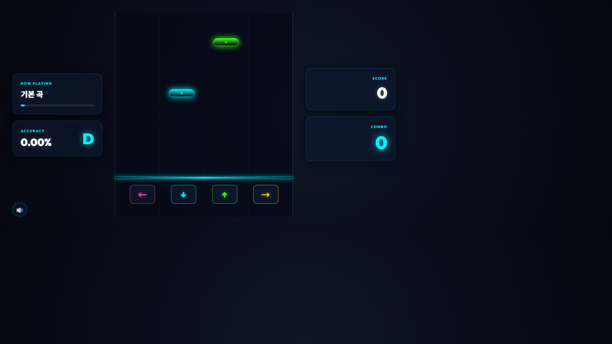

# 12차시 · 노트가 떨어지는 화면

!!! note "이번 차시에 하는 일"
    - 화면에 방향키(← ↓ ↑ →) 4개짜리 **세로줄(레인)** 을 그려 달라고 부탁합니다
    - 위에서 아래로 **노트가 떨어지는** 움직임을 만들어 달라고 부탁합니다
    - 브라우저에서 노트가 실제로 떨어지는 모습을 확인합니다

> ⏱️ 걸리는 시간: 약 40분 · 🧰 준비물: 11차시에서 만든 프로젝트, Claude Code, 터미널 창 2개

---

## 왜 이걸 하나요?

지난 시간에 만든 화면은 제목과 버튼뿐인, 아직 밋밋한 화면이었습니다. 리듬게임의 진짜 재미는 **노트가 하늘에서 비처럼 떨어지는 모습**에서 시작됩니다. 노트가 각자의 줄(레인)을 타고 아래로 흘러내리다가, 판정선에 닿는 순간 방향키를 누르는 것 — 그게 리듬게임입니다.

이번 차시에서는 아직 **키를 눌러서 맞추는 것까지는 하지 않습니다.** (그건 13차시입니다.) 오늘은 딱 하나, **노트가 떨어지는 모습을 눈으로 보는 것**까지만 갑니다. 한 단계씩 쌓아 올리는 게 이 책의 방식입니다.

---

## 따라 하기

### 단계 ① 터미널 창을 하나 더 엽니다

11차시에서 켜 둔 게임 서버(`npx expo start --web`)는 계속 그대로 둡니다. 그 창을 끄면 브라우저 화면도 꺼집니다. 대신 **새 터미널 창을 하나 더 열어서** 거기서 Claude Code에게 말을 겁니다(3차시에서 배운 방법 그대로 새 창을 엽니다).

!!! quote "🗣️ 이대로 입력해 보세요 (새 터미널 창에서)"
    ```
    cd $HOME\Desktop\rhythm-game
    claude
    ```

<!-- FIG: id=c12-f01 | type=스크린샷 | src=manual | status=todo | file=images/c12/c12-f01.png -->
> **그림 12.1 — 터미널 창 2개를 나란히 띄운 모습 (왼쪽: 게임 서버, 오른쪽: Claude Code 대화)**
>
> *[캡처 예정(저자): 한 화면에 게임 서버 로그 창과 Claude Code 채팅 창을 나란히 배치한 모습.]*

!!! tip "💡 저절로 바뀌는 화면 — '자동 새로고침'"
    Claude Code가 파일을 고치면, 이미 켜 둔 브라우저 화면이 **손대지 않아도 저절로 바뀝니다.** 새로고침 버튼을 누를 필요가 없습니다. 이 기능을 기억해 두면 앞으로 훨씬 편합니다.

### 단계 ② 세로줄(레인) 4개를 만들어 달라고 부탁합니다

!!! quote "🗣️ 이대로 복사해서 붙여넣으세요 (AI에게 하는 말)"
    ```
    이제 게임 화면에 4개의 세로줄(레인)을 만들어줘.
    화면 전체를 가로로 4칸으로 나눠서 줄을 그려주고,
    맨 아래쪽에 각 줄이 어떤 방향키인지 알 수 있게
    왼쪽부터 순서대로 ← ↓ ↑ → 화살표 모양을 하나씩 넣어줘.
    지금은 줄만 보이면 되고, 아직 아무것도 안 떨어져도 괜찮아.
    ```

승인을 물어보면 엔터로 진행합니다. 끝나면 브라우저를 보세요. 새로고침을 안 눌러도 화면에 4개의 줄과 화살표가 나타나 있을 것입니다.

<!-- FIG: id=c12-f02 | type=스크린샷 | src=manual | status=todo | file=images/c12/c12-f02.png -->
> **그림 12.2 — 4개의 레인과 하단 방향키(← ↓ ↑ →) 안내가 나타난 화면**
>
> *[캡처 예정(저자): 노트 없이 레인 4개 + 하단 화살표만 보이는 중간 단계 화면.]*

!!! warning "⚠️ 조심 — 화면이 안 바뀌면"
    잠깐 기다려도 그대로면, 브라우저 창을 한 번 눌러 클릭해 보세요. 그래도 안 바뀌면 그 창에서 `F5`(새로고침)를 눌러 보세요. 여전히 이상하면 5분 룰 — 화면을 그대로 두고 Claude Code에게 "화면이 안 바뀌었어, 확인해줘"라고 말합니다.

### 단계 ③ 노트가 떨어지게 부탁합니다

이제 진짜 알맹이입니다. 레인 위로 노트가 흘러내리게 부탁합니다.

!!! quote "🗣️ 이대로 복사해서 붙여넣으세요 (AI에게 하는 말)"
    ```
    이제 각 레인 맨 위에서 동그란 노트가 하나씩 생겨서
    아래로 천천히 흘러내리게 만들어줘.
    노트가 화면 맨 아래 판정선까지 내려오면 사라지게 해줘.
    노트가 나오는 속도는 기본곡 120BPM 박자에 맞춰줘.
    지금은 키를 눌러서 맞추는 기능은 만들지 말고,
    노트가 자연스럽게 떨어지는 모습만 먼저 보여줘.
    ```

승인을 물어보면 엔터로 넘어갑니다. 이번에도 조금 기다리면 브라우저 화면이 저절로 바뀝니다.

### 단계 ④ 노트가 떨어지는 모습을 확인합니다

아래처럼 레인마다 동그란 노트가 위에서 아래로 흘러내리는 모습이 보이면 성공입니다. 아직 판정선을 맞히는 기능은 없지만, **드디어 게임처럼 보이기 시작**합니다.

<!-- FIG: id=c12-f03 | type=스크린샷 | src=capture | file=images/game/game_play1.png -->
> **그림 12.3 — 4개 레인 위로 노트가 떨어지는 실제 화면**
>
> *[참고: 이 화면에는 점수·판정선 등 이후 차시(13~14차시)에서 완성할 요소도 함께 보입니다. 지금은 "노트가 떨어진다"는 것만 확인하면 충분합니다.]*



!!! tip "💡 속도가 마음에 안 들면"
    노트가 너무 빨리 쏟아지거나 너무 느리게 느껴지면 "노트가 떨어지는 속도를 좀 느리게(또는 빠르게) 해줘"라고 이어서 부탁하면 됩니다. 숫자나 용어를 몰라도 **눈으로 본 느낌 그대로 말하면** AI가 알아듣습니다.

!!! warning "⚠️ 조심 — 지금은 키를 눌러도 반응이 없고 소리도 나지 않습니다"
    당연합니다! 방향키를 눌러서 노트를 맞추는 기능은 아직 만들지 않았고, 음악 소리 역시 15차시에서 얹게 됩니다. "왜 소리도 안 나고 키를 눌러도 안 맞아요?"라고 걱정하지 마세요. 바로 다음 단계들에서 순서대로 만듭니다.


---

!!! success "✅ 여기까지 됐으면"
    - ☐ 화면에 **방향키 4개짜리 레인**을 만들었다
    - ☐ 레인 위로 **노트가 위에서 아래로 떨어지는** 모습을 만들었다
    - ☐ 브라우저에서 노트가 흘러내리는 것을 **눈으로 확인**했다

!!! abstract "📌 핵심 요약"
    - 파일을 고치면 브라우저는 **저절로 새로 그려진다**(자동 새로고침).
    - 부탁은 "레인 4개 만들어줘" → "노트가 떨어지게 해줘" **순서대로 한 걸음씩.**
    - 지금은 **보여주기까지만**, 키로 맞추는 것은 다음 차시.

!!! question "🤔 혼자 해보기"
    Q. 지금 화면에서 방향키를 눌러도 아무 반응이 없는 이유는 무엇인가요?

    ✍️ ________________________________________________

!!! info "🔎 낱말 사전"
    - **레인** — 노트가 흘러내리는 세로줄. 이 게임은 4개(← ↓ ↑ →).
    - **노트** — 레인을 타고 위에서 아래로 떨어지는 동그라미. 이걸 맞추는 게 리듬게임.
    - **판정선** — 노트가 도착하는 화면 아래쪽 기준선. 다음 차시부터 여기서 키를 맞춥니다.
    - **자동 새로고침** — 파일이 바뀌면 브라우저가 스스로 다시 그려주는 기능.

> **다음 차시 예고** — 13차시에서는 드디어 **방향키를 눌러 노트를 맞히는** 판정 기능을 만듭니다. 지금까지는 구경이었다면, 이제부터는 진짜로 "플레이"가 시작됩니다.
