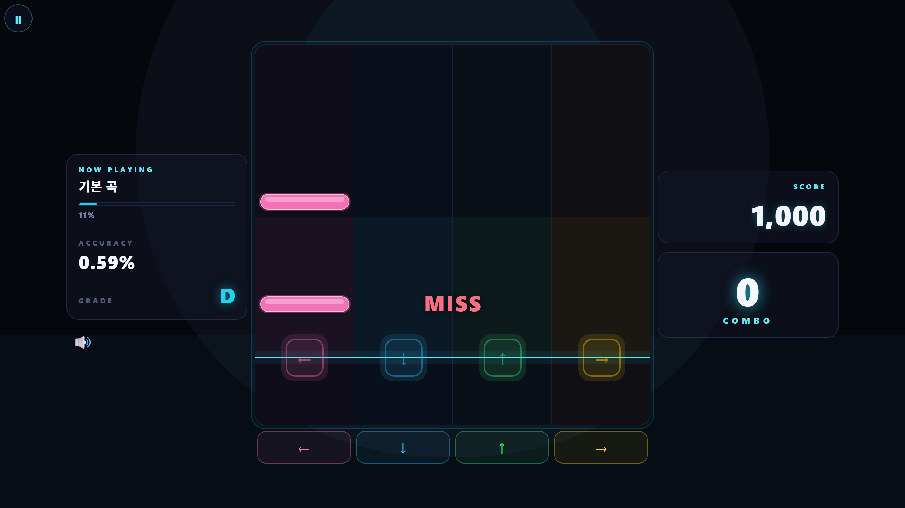

# 14차시 · 점수·콤보 보여주기

!!! note "이번 차시에 하는 일"
    - 노트를 잘 맞출 때마다 **점수(SCORE)**가 올라가게 합니다
    - 연속으로 잘 맞추면 **콤보(COMBO, 연속 성공 횟수)**가 쌓이게 합니다
    - **정확도(%)**와 **등급**도 화면에 보이게 합니다

> ⏱️ 걸리는 시간: 약 25~35분 · 🧰 준비물: 13차시까지 만든 리듬게임 폴더, Claude Code

---

## 왜 이걸 하나요?

13차시에서 판정(PERFECT/GREAT/GOOD/MISS)까지 만들었지만, 잘 쳤는지 못 쳤는지 결과가 쌓이지 않고 사라집니다. 점수판은 늘 0에 멈춰 있죠. 이번엔 잘할 때마다 숫자가 쭉쭉 올라가는 **성취감**을 더합니다. 점수·콤보는 리듬게임의 "실력 계기판"입니다. 숫자가 오르는 걸 보는 순간, 게임이 진짜 게임처럼 느껴집니다.

---

## 따라 하기

### 단계 ① 지금 상태를 다시 확인합니다

지금 화면 오른쪽 위 점수판을 보면, 아무리 노트를 잘 쳐도 **SCORE와 COMBO가 그대로 0**에 머물러 있습니다.

<!-- FIG: id=c14-f01 | type=스크린샷 | src=manual | status=todo | file=images/c14/c14-f01.png -->
> **그림 14.1 — 아직 점수가 0에 머물러 있는 화면**
>
> *[캡처 예정(저자): 13차시 결과물에서 노트를 쳐도 SCORE/COMBO가 안 오르는 화면.]*

### 단계 ② AI에게 "점수와 콤보를 쌓아 달라"고 부탁합니다

!!! quote "🗣️ 이대로 복사해서 붙여넣으세요 (AI에게 하는 말)"
    ```
    노트를 PERFECT나 GREAT, GOOD으로 맞출 때마다
    점수(SCORE)가 올라가게 해줘. PERFECT가 가장 점수를
    많이 주면 좋겠어.

    그리고 콤보(COMBO, 연속으로 성공한 횟수)도 만들어줘.
    잘 맞출 때마다 콤보가 1씩 늘어나고, MISS가 나오면
    콤보가 다시 0으로 끊기게 해줘.

    화면 오른쪽 위에 지금까지 모은 점수와, 지금 이어지고
    있는 콤보 숫자를 크고 잘 보이게 보여줘. 그리고 지금까지
    얼마나 정확하게 쳤는지 정확도(%)와 등급(예: S, A, B…)도
    같이 보여줘.
    ```

AI가 "이렇게 해도 될까요?"라고 물으면 엔터로 승인합니다.

### 단계 ③ 게임을 플레이하며 확인합니다

브라우저를 새로고침하고, 노트를 몇 개 쳐 봅니다. 잘 맞으면 점수가 오르고, 콤보 숫자도 같이 올라가는지 확인합니다. 중간에 하나를 놓치면 콤보만 0으로 끊기고, 이미 모은 점수는 그대로 남습니다.

<!-- FIG: id=c14-f02 | type=스크린샷 | src=capture | file=images/game/game_play3.png -->
> **그림 14.2 — 점수는 1,000점까지 올랐지만, 방금 하나를 놓쳐 콤보가 0으로 끊긴 화면**
>
> 오른쪽 위 **SCORE**와 **COMBO**, 왼쪽의 **ACCURACY(정확도)**와 **GRADE(등급)**를 함께 볼 수 있습니다.



### 단계 ④ 정확도와 등급이 무엇인지 확인합니다

그림 14.2를 보면 **ACCURACY**(정확도)는 지금까지 친 노트 전체 중 얼마나 정확했는지를 %로 보여주고, **GRADE**(등급)는 그 정확도를 학교 성적처럼 알파벳(D, C, B, A, S 등)으로 알려줍니다. 자주 놓치면 정확도와 등급이 함께 낮게 나옵니다.

### 단계 ⑤ 프롬프트로 조금씩 다듬어 봅니다

한 번에 완벽하게 만들 필요 없습니다. 플레이해 보고 아쉬운 점을 하나씩 말해 보세요.

!!! quote "🗣️ 이대로 복사해서 붙여넣으세요 (AI에게 하는 말)"
    ```
    점수가 올라갈 때 숫자가 통통 튀듯이
    살짝 커졌다가 작아지는 효과를 넣어줘.

    그리고 콤보가 10을 넘으면 콤보 숫자 색깔이
    눈에 확 띄게 바뀌도록 해줘.
    ```

이렇게 **작은 부탁을 하나씩** 이어서 하면, 게임이 조금씩 더 화려하고 재미있어집니다.

<!-- FIG: id=c14-f03 | type=스크린샷 | src=manual | status=todo | file=images/c14/c14-f03.png -->
> **그림 14.3 — 콤보가 높이 쌓여 화면이 화려하게 반응하는 순간**
>
> *[캡처 예정(저자): 콤보 강조 효과 적용 후, 콤보 10 이상일 때 화면.]*

---

!!! tip "💡 처음부터 완벽할 필요 없습니다"
    "점수 계산이 이상해요"보다 "PERFECT일 때 점수를 좀 더 많이 줘"처럼 **구체적으로, 하나씩** 부탁하면 AI가 더 정확하게 고쳐 줍니다.

!!! warning "⚠️ 조심 — 한 번에 너무 많이 부탁하지 마세요"
    "점수도 바꾸고 콤보도 바꾸고 색깔도 바꾸고 효과음도 넣어줘" 처럼 한꺼번에 여러 가지를 부탁하면 AI가 헷갈릴 수 있습니다. **한두 가지씩** 부탁하고 확인한 뒤 다음을 부탁하세요.

!!! success "✅ 여기까지 됐으면"
    - ☐ 노트를 잘 맞출 때마다 **점수가 오른다**
    - ☐ 연속으로 성공하면 **콤보가 쌓이고**, 놓치면 **0으로 끊긴다**
    - ☐ **정확도(%)**와 **등급**이 화면에 함께 보인다

!!! abstract "📌 핵심 요약"
    - AI에게 "잘 맞출 때마다 점수를 올리고, 연속 성공은 콤보로, 놓치면 콤보를 끊어 줘"라고 부탁하면 됩니다.
    - 정확도(%)와 등급은 지금까지의 실력을 한눈에 보여줍니다.
    - 완성도는 **작은 프롬프트를 여러 번** 이어서 부탁하며 조금씩 높여 갑니다.

!!! question "🤔 혼자 해보기"
    Q. 콤보가 10 쌓여 있다가 노트를 하나 MISS 했습니다. 콤보는 몇이 될까요?

    ✍️ ________________________________________________

!!! info "🔎 낱말 사전"
    - **SCORE(점수)** — 노트를 맞출 때마다 쌓이는 숫자. 놓쳐도 줄지 않습니다.
    - **COMBO(콤보)** — 연속으로 성공한 횟수. MISS가 나오면 0으로 끊깁니다.
    - **ACCURACY(정확도)** — 지금까지 친 노트 전체 중 얼마나 정확했는지 나타내는 비율(%).
    - **GRADE(등급)** — 정확도를 알파벳(D~S 등)으로 표시한 성적표.

> **다음 차시 예고** — 15차시에서는 기본곡(120BPM)에 맞춰 정해진 노트 패턴이 흘러나오도록 하고, 음악과 노트 타이밍을 맞춰 봅니다.
