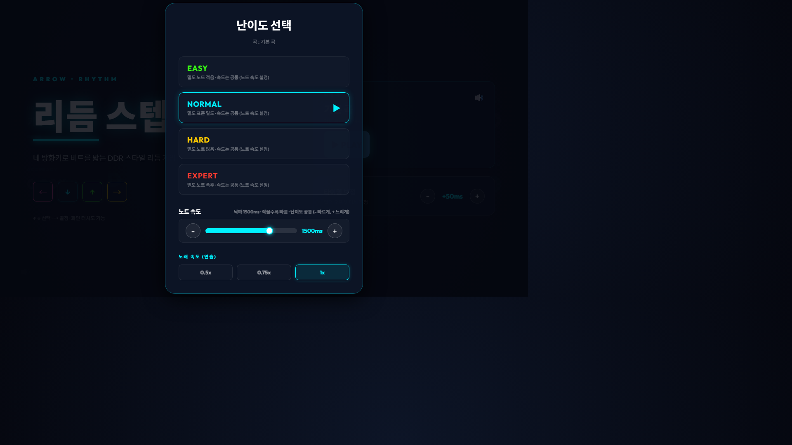

# 15차시 · 음악·박자와 노트 맞추기

!!! note "이번 차시에 하는 일"
    - 기본곡(120BPM, 1분에 120번 박자)에 맞춰 **노트가 정확한 박자에 떨어지는지** 확인합니다
    - **난이도**와 **노트 속도·노래 속도**를 내 손에 맞게 골라 봅니다
    - "정확히 눌렀는데 자꾸 놓친다" 싶을 때 **타이밍 보정(±)**으로 딱 맞춰 줍니다

> ⏱️ 걸리는 시간: 약 30분 · 🧰 준비물: 11~14차시에서 만든 게임

---

## 왜 이걸 하나요?

노래방 기계를 생각해 보세요. 화면 자막이 노래보다 반 박자만 늦거나 빨라도 따라 부르기 힘들어집니다. 리듬게임도 똑같습니다. 노트가 노래 박자에 딱 맞게 떨어져야 재미있고, 내가 화면을 보고 정확히 눌렀는데도 게임이 "늦었다"고 판정하면 억울해지죠. 이번 차시는 그 "박자 맞음"을 눈으로 확인하고, 안 맞으면 고치는 시간입니다.

!!! warning "⚠️ 조심 — 이 게임엔 '자동 채보' 기능이 없습니다"
    내가 좋아하는 노래를 넣으면 AI가 알아서 박자를 분석해 노트를 만들어 주는 기능은 이 책에서 다루지 않습니다. 우리 게임은 **미리 정해 둔 고정 노트 패턴**(기본곡·120BPM)으로 움직입니다. 곡을 바꾸는 것보다, 지금 곡에 노트를 잘 맞추는 것이 이번 차시의 목표입니다.

---

## 따라 하기

### 단계 ① 난이도와 속도 선택 화면 만들기

먼저 AI에게 난이도별로 노트 속도·노래 속도를 고를 수 있는 화면을 만들어 달라고 부탁합니다.

!!! quote "🗣️ 이대로 복사해서 붙여넣으세요 (AI에게 하는 말)"
    ```
    게임 시작 전에 난이도를 고르는 화면을 만들어줘.
    EASY, NORMAL, HARD, EXPERT 4단계로 나누고
    (난이도가 높을수록 노트가 더 촘촘하게 나오면 좋겠어).
    그리고 노트가 떨어지는 속도를 조절하는 슬라이더랑,
    연습할 때 노래를 0.5배, 0.75배로 느리게 들을 수 있는
    버튼도 같이 넣어줘.
    ```

AI가 화면을 만들고 나면, 실행해서 아래처럼 보이는지 확인합니다.

<!-- FIG: id=c15-f01 | type=스크린샷 | src=capture | file=images/game/game_difficulty.png -->
> **그림 15.1 — 난이도·노트 속도·노래 속도 선택 화면**



이 화면에서 **노트 속도**(그림의 "1500ms")는 노트가 위에서 나타나 판정선까지 떨어지는 데 걸리는 시간입니다. 숫자가 작을수록 노트가 빨리 훅 떨어지고, 클수록 천천히 떨어집니다. **노래 속도(연습)**는 곡 전체를 느리게 틀어서(0.5배·0.75배) 박자를 눈과 귀로 천천히 익히도록 도와주는 연습용 기능입니다.

### 단계 ② 내 손에 맞는 난이도로 먼저 연습하기

처음부터 어려운 난이도로 시작하면 박자를 눈으로 좇기도 전에 노트가 지나가 버립니다. EASY로 시작해서 노래 속도도 0.5배로 낮춰 놓고, 노트가 판정선에 떨어지는 순간과 노래 박자가 실제로 맞는지 천천히 지켜보세요.

!!! tip "💡 이럴 땐 — 박자가 안 맞는 것처럼 느껴진다면"
    화면을 몇 번 반복해서 보면, 사실 노트는 정확한 박자에 떨어지고 있는데 **내가 누르는 손이 반박자 느린 경우**가 훨씬 많습니다. 노래 속도를 0.5배로 낮춰서 다시 확인해 보세요.

### 단계 ③ "정확히 눌렀는데 놓쳤다" 싶을 때 — 타이밍 보정 요청하기

블루투스(무선) 키보드나 화면마다 반응하는 데 걸리는 시간이 사람·기기마다 아주 조금씩 다릅니다. 내 눈에는 정확히 맞춰 눌렀는데 게임이 계속 "늦음" 또는 "빠름"으로 판정한다면, 그 차이를 미리 당기거나 늦춰서 맞추는 기능이 필요합니다.

!!! quote "🗣️ 이대로 복사해서 붙여넣으세요 (AI에게 하는 말)"
    ```
    내가 화면을 보고 정확히 맞춰 누르는데도
    자꾸 판정이 늦거나 빠르게 나와.
    내가 직접 판정 시점을 몇 십 밀리초(ms) 단위로
    당기거나 늦출 수 있는 "타이밍 보정" 기능을 만들어줘.
    +와 - 버튼으로 조절하고, 지금 보정값이 몇 ms인지
    화면에 숫자로 보여줘.
    ```

<!-- FIG: id=c15-f02 | type=스크린샷 | src=manual | status=todo | file=images/c15/c15-f02.png -->
> **그림 15.2 — 타이밍 보정(+/- ms) 조절 화면**
>
> *[캡처 예정(저자): AI가 만들어 준 타이밍 보정 슬라이더/버튼 화면. "+50ms" 처럼 숫자가 보이는 상태로.]*

### 단계 ④ 나에게 맞는 보정값 찾기

보정값을 한 번에 딱 맞추기는 어렵습니다. 10~20ms씩 조금씩 바꿔 가며 콤보(연속으로 맞은 횟수)가 잘 이어지는 값을 찾으면 됩니다.

!!! tip "💡 이럴 땐 — 어느 방향으로 조절해야 할지 모르겠다면"
    - 판정이 자꾸 **"빠름(내가 일찍 눌렀다)"**으로 나온다 → 보정값을 **+ 방향**으로(판정을 살짝 늦게 인식하게) 조절해 보세요.
    - 판정이 자꾸 **"늦음(내가 늦게 눌렀다)"**으로 나온다 → 보정값을 **- 방향**으로(판정을 살짝 빠르게 인식하게) 조절해 보세요.
    - **[주의]** AI가 코드를 짤 때 보정값 계산 식의 부호(+/-) 방향을 본 설명과 **반대로 구현**할 수도 있습니다. + 방향으로 조절했는데 판정이 더 어긋난다면 반대로 - 방향으로 조절해 보며 나에게 맞는 설정을 찾으세요.

!!! warning "⚠️ 조심 — 완벽한 '0'을 목표로 하지 마세요"
    사람마다 반응 속도가 다르고, 키보드(특히 블루투스 무선)마다 신호가 도착하는 시간이 조금씩 다릅니다. 정답은 없습니다. 내가 편하게 콤보를 이어갈 수 있는 값이면 충분합니다.

---

!!! success "✅ 여기까지 됐으면"
    - ☐ 기본곡(120BPM)에 맞춰 노트가 떨어지는 것을 확인했다
    - ☐ 난이도·노트 속도·노래 속도를 내 손에 맞게 골랐다
    - ☐ 타이밍 보정(+/-)으로 판정이 더 잘 맞도록 조절했다

!!! abstract "📌 핵심 요약"
    - 이 게임은 **미리 정해진 고정 노트 패턴**(120BPM)으로 움직입니다. 자동 채보는 없습니다.
    - **노트 속도**는 노트가 떨어지는 데 걸리는 시간, **노래 속도(연습)**는 곡을 느리게 듣는 연습 기능입니다.
    - 정확히 눌러도 계속 어긋나면, **타이밍 보정(+/- ms)**을 프롬프트로 요청해 내 손·내 기기에 맞게 조절합니다.

!!! question "🤔 혼자 해보기"
    Q. 노트를 정확히 눌렀는데 게임이 계속 "늦음(LATE)"으로 판정한다면, 타이밍 보정값을 어느 방향으로 조절해야 할까요?

    ✍️ ________________________________________________

!!! info "🔎 낱말 사전"
    - **BPM** — 1분에 몇 번 박자가 있는지 나타내는 숫자. 120BPM은 1분에 120번.
    - **노트 속도** — 노트가 나타나서 판정선까지 떨어지는 데 걸리는 시간(ms). 작을수록 빨리 떨어짐.
    - **타이밍 보정(오프셋)** — 내가 누른 시점과 게임이 인식하는 시점의 차이를 미리 당기거나 늦춰서 맞추는 값.
    - **ms(밀리초)** — 1000분의 1초. 1000ms = 1초.

> **다음 차시 예고** — 16차시에서는 이제 잘 작동하는 게임을 **내 마음대로 색·글꼴·문구·효과로 꾸며서** 진짜 "내 게임"처럼 만들어 봅니다.
