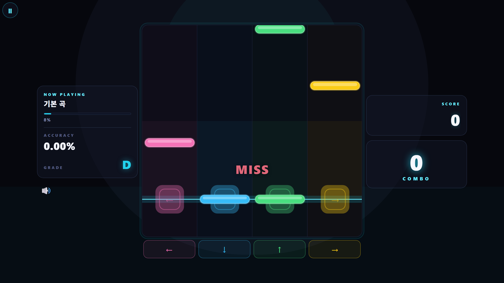

# 20차시 · 남에게 보여주기

!!! note "이번 차시에 하는 일"
    - 완성한 리듬게임 화면을 **사진**으로 남깁니다
    - 플레이하는 모습을 **동영상**으로 녹화합니다
    - 원한다면 AI에게 부탁해서 **인터넷 주소(링크)**로도 보여줍니다

> ⏱️ 걸리는 시간: 약 25분 · 🧰 준비물: 완성된 리듬게임(4마당), 인터넷 연결

---

## 왜 이걸 하나요?

여기까지 오시느라 정말 고생하셨습니다. 프롬프트만으로 리듬게임 한 편을 완성했고, 키링 키보드로 직접 플레이도 해봤습니다. 그런데 이 게임을 나만 보고 끝내면 조금 아쉽습니다. 사진 한 장, 영상 한 편이면 가족이나 친구에게 "내가 이런 걸 만들었다"고 자랑할 수 있습니다.

<!-- FIG: id=c20-f01 | type=스크린샷 | src=capture | file=images/game/game_start.png -->
> **그림 20.1 — 우리가 함께 완성한 리듬게임 시작 화면**


---

## 따라 하기

### 단계 ① 화면을 사진으로 남깁니다

윈도우에는 화면을 사진처럼 찍어주는 도구가 이미 들어 있습니다. 게임이 실행된 브라우저 창에서 키보드의 `Windows` 키를 누른 채 `Shift`와 `S`를 같이 누르면(**`Win + Shift + S`**), 화면이 흐려지면서 캡처 도구가 뜹니다. 마우스로 게임 화면 부분을 드래그해서 선택하면, 그 부분만 사진으로 복사됩니다.

<!-- FIG: id=c20-f02 | type=스크린샷 | src=manual | status=todo | file=images/c20/c20-f02.png -->
> **그림 20.2 — `Win + Shift + S`를 누르면 뜨는 캡처 도구**
>
> *[캡처 예정(저자): 화면 캡처 도구 실행 화면. 개인정보 노출 없는 상태로.]*

복사된 사진은 그림판이나 카카오톡 채팅창에 그냥 붙여넣기(`Ctrl+V`)만 하면 바로 보낼 수 있습니다.

<!-- FIG: id=c20-f03 | type=스크린샷 | src=capture | file=images/game/game_play2.png -->
> **그림 20.3 — 이렇게 플레이 중인 화면을 찍어두면 좋습니다**



!!! tip "💡 어떤 순간을 찍을까요"
    시작 화면, 난이도 고르는 화면, 콤보가 잘 쌓였을 때 점수판까지 — 3장 정도만 찍어도 "이런 게임을 만들었다"는 게 충분히 전해집니다.

### 단계 ② 플레이하는 모습을 동영상으로 남깁니다

사진보다 실감 나게 보여주고 싶다면 녹화를 해봅니다. 윈도우 키를 누른 채 `G`를 누르면(**`Win + G`**) "Xbox 게임 바(Game Bar)"라는 녹화 도구가 뜹니다. 여기서 동그란 **[녹화 시작]** 버튼을 누르고 게임을 플레이한 뒤, 같은 버튼을 다시 누르면 녹화가 끝납니다.

<!-- FIG: id=c20-f04 | type=스크린샷 | src=manual | status=todo | file=images/c20/c20-f04.png -->
> **그림 20.4 — `Win + G`로 열리는 녹화 도구**
>
> *[캡처 예정(저자): Xbox 게임 바 녹화 버튼 화면.]*

녹화된 영상은 내 컴퓨터의 **[내 PC → 동영상 → 캡처]** 폴더에 자동으로 저장됩니다. (4차시에서 배운 파일 탐색기로 찾아가면 됩니다.)

!!! warning "⚠️ 조심 — 브라우저 창이 꼭 보여야 녹화됩니다"
    Xbox 게임 바는 지금 화면에 떠 있는 창을 녹화합니다. 게임이 있는 브라우저 창을 다른 창 뒤로 숨기지 말고, 맨 앞에 띄워 둔 채로 녹화하세요.

### 단계 ③ AI에게 부탁해서 인터넷 링크로도 보여줍니다

사진과 영상만으로도 충분하지만, "인터넷 주소만 알려주면 아무나 브라우저에서 내 게임을 직접 눌러볼 수 있게" 하고 싶을 수도 있습니다. 이렇게 인터넷에 올려서 누구나 접속할 수 있게 만드는 걸 **배포(deploy)**라고 부릅니다. 배포 과정은 여러 단계가 있어서 조금 복잡한데, 이것도 AI에게 그대로 맡기면 됩니다.

Claude Code를 켜고, 아래처럼 부탁해 보세요.

!!! quote "🗣️ 이대로 복사해서 붙여넣으세요 (AI에게 하는 말)"
    ```
    이 리듬게임을 인터넷 주소(링크)로 다른 사람도
    브라우저에서 바로 볼 수 있게 올리고 싶어.
    어떤 방법이 제일 쉽고 무료인지 추천해주고,
    그 방법대로 필요한 걸 다 준비해줘.
    나는 뭘 확인하고 눌러야 하는지만 알려줘.
    ```

AI가 방법을 추천하고, 필요한 절차를 차례로 안내해 줄 것입니다. 중간에 "이렇게 진행해도 될까요?"라고 물으면 승인(엔터)만 하면 됩니다. 끝나면 `https://...`로 시작하는 **인터넷 주소(링크)**를 받게 됩니다.

<!-- FIG: id=c20-f05 | type=스크린샷 | src=manual | status=todo | file=images/c20/c20-f05.png -->
> **그림 20.5 — 배포가 끝나고 받은 인터넷 주소 화면 예시**
>
> *[캡처 예정(저자): AI가 배포를 마친 뒤 인터넷 주소를 알려주는 터미널 화면.]*

!!! tip "💡 어떤 방법을 추천해줄지는 그때그때 다릅니다"
    AI가 추천하는 배포 방법이나 서비스는 시기에 따라 달라질 수 있습니다. 책에 나온 것과 달라도 걱정하지 마세요. AI가 안내하는 대로 하나씩 따라가면 됩니다.

!!! warning "⚠️ 조심 — 한 번에 안 될 수도 있습니다"
    배포는 처음 시도할 때 오류가 나는 경우가 흔합니다. 화면에 빨간 글씨(오류 메시지)가 보이면, 겁먹지 말고 그 글자를 그대로 복사해서 AI에게 "이런 오류가 났는데 고쳐줘"라고 보여주세요.

### 단계 ④ 받은 링크를 나눠줍니다

받은 인터넷 주소를 카카오톡이나 문자로 그대로 복사해서 보내면, 받은 사람은 컴퓨터든 스마트폰이든 브라우저만 있으면 내 게임을 바로 열어볼 수 있습니다.

<!-- FIG: id=c20-f06 | type=스크린샷 | src=manual | status=todo | file=images/c20/c20-f06.png -->
> **그림 20.6 — 카카오톡에 인터넷 주소를 붙여넣어 보내는 화면**
>
> *[캡처 예정(저자): 메신저에 링크를 붙여넣는 화면. 개인정보 가린 상태로.]*

---

!!! tip "💡 링크가 언제까지 열리나요"
    무료로 올린 링크는 서비스에 따라 계속 열려 있을 수도, 일정 기간만 열려 있을 수도 있습니다. 오래 보여주고 싶다면 AI에게 "이 링크가 계속 열려 있게 하려면 어떻게 해야 해?"라고 다시 물어보세요.

!!! success "✅ 여기까지 됐으면"
    - ☐ 게임 화면을 **사진**으로 최소 1장 찍었다
    - ☐ 플레이하는 모습을 **동영상**으로 녹화해봤다(선택)
    - ☐ AI에게 부탁해서 **인터넷 링크**를 만들어보거나, 만드는 과정을 지켜봤다

!!! abstract "📌 핵심 요약"
    - 사진은 **`Win + Shift + S`**, 영상은 **`Win + G`**로 남깁니다.
    - 인터넷에 올려 누구나 보게 하는 것을 **배포**라고 하며, 세부 과정은 AI에게 맡기면 됩니다.
    - 완성된 인터넷 주소(링크)는 카카오톡·문자로 그대로 보내면 됩니다.

!!! question "🤔 혼자 해보기"
    Q. 화면을 사진으로 찍는 단축키와, 영상으로 녹화하는 단축키는 각각 무엇인가요?

    ✍️ ________________________________________________

!!! info "🔎 낱말 사전"
    - **캡처 도구** — 화면 일부를 사진처럼 찍어 저장하는 윈도우 기능(`Win+Shift+S`).
    - **Xbox 게임 바** — 화면을 동영상으로 녹화하는 윈도우 기능(`Win+G`).
    - **배포(deploy)** — 내가 만든 프로그램을 인터넷에 올려 누구나 쓸 수 있게 만드는 것.
    - **링크(인터넷 주소)** — `https://...`로 시작하는, 클릭하면 바로 접속되는 주소.

> **다음 차시 예고** — 다음은 이 책의 마지막, 21차시입니다. 여기까지 배운 것을 정리하고, 앞으로 더 해볼 만한 것들을 소개하며 마무리합니다.
