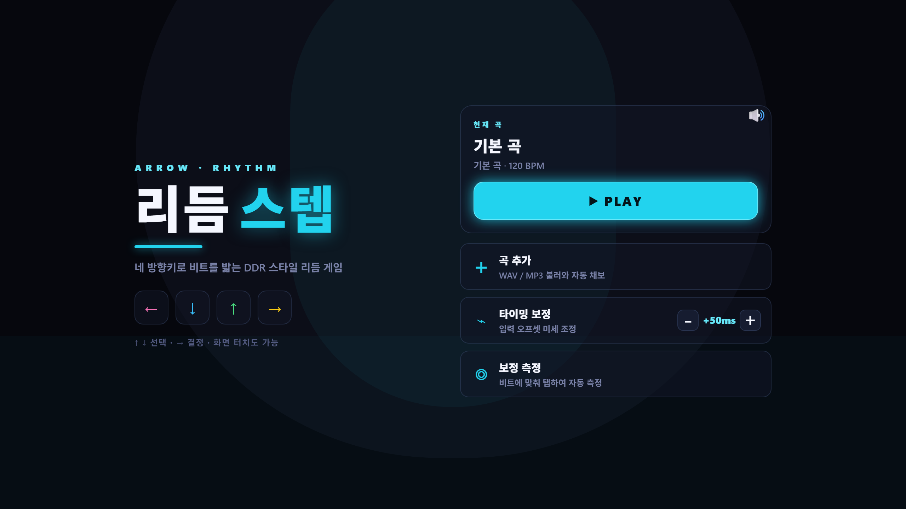

# 21차시 · 다음 단계 로드맵

!!! note "이번 차시에 하는 일"
    - 이 책에서 **배운 것**을 처음부터 죽 훑어봅니다
    - 앞으로 **더 해볼 만한 것**들을 알아봅니다
    - 막힐 때 어디를 펴보면 되는지 확인하고, 마무리합니다

> ⏱️ 걸리는 시간: 약 15분 · 🧰 준비물: 없음(그냥 편하게 읽으세요)

---

## 왜 이걸 하나요?

<!-- FIG: id=c21-f01 | type=스크린샷 | src=capture | file=images/game/game_start.png -->
> **그림 21.1 — 처음엔 낯설었던 이 화면, 이제는 여러분이 직접 만든 게임입니다**



1차시에서 "바이브코딩이 뭐예요?"라고 물으며 시작했던 여정이 여기까지 왔습니다. 코드를 한 줄도 직접 치지 않고, 말(프롬프트)만으로 게임 한 편을 완성하고, 키링 키보드로 플레이하고, 남에게 자랑까지 했습니다. 이제는 "다음엔 뭘 더 해볼까"를 이야기할 차례입니다.

---

## 이 책에서 배운 것, 한눈에 정리

- **1마당** — 바이브코딩이 뭔지, AI 코딩 도구가 뭐가 있는지 지도를 그렸습니다.
- **2마당** — 터미널, 파일 탐색기, Node.js까지 컴퓨터와 친해졌습니다.
- **3마당** — Claude Code를 주력으로 설치하고, Codex·OpenCode·Antigravity까지 둘러보며 "프롬프트는 어디서든 통한다"를 확인했습니다.
- **4마당** — 프롬프트만으로 리듬게임의 노트 화면, 키 판정, 점수·콤보, 음악과 박자, 꾸미기까지 완성했습니다.
- **5마당** — 키링 키보드를 블루투스로 페어링하고, 직접 플레이했습니다.
- **6마당** — 만든 게임을 사진·영상·링크로 남에게 보여줬습니다.

!!! success "✅ 지금 여러분에게 남은 것"
    - ☐ 브라우저에서 도는 **내 리듬게임** 한 편
    - ☐ **키링 키보드**로 직접 플레이해 본 경험
    - ☐ 남에게 보여줄 수 있는 **사진·영상·링크**

---

## 더 해볼 만한 것들

여기서 끝내도 충분하지만, 조금 더 놀아보고 싶다면 아래처럼 AI에게 또 부탁해 보세요. 방법은 지금까지와 똑같습니다. **말로 부탁하고, 결과를 확인하는 것.**

### 다른 곡으로 바꿔보기

!!! quote "🗣️ 이렇게 부탁해보세요"
    ```
    지금 게임에 쓰는 곡 말고, 좀 더 신나는 느낌의
    다른 곡과 노트 패턴으로 바꿔줘.
    ```

### 화면을 내 마음대로 꾸며보기

!!! quote "🗣️ 이렇게 부탁해보세요"
    ```
    노트가 떨어질 때 반짝이는 효과를 넣고,
    배경도 좀 더 화려하게 바꿔줘.
    ```

### 친구·가족과 점수 대결하기

!!! quote "🗣️ 이렇게 부탁해보세요"
    ```
    최고 점수를 저장해두고,
    새 기록이 나오면 화면에 보여주는 기능을 추가해줘.
    ```

!!! tip "💡 안 되면 어떻게 하나요"
    새로운 걸 부탁했는데 이상하게 나오거나 오류가 나도 괜찮습니다. "방금 그거 마음에 안 드는데 원래대로 되돌려줘"라고 말하면 됩니다. AI는 몇 번을 다시 부탁해도 화내지 않습니다.

---

## 막힐 때는 부록을 펴보세요

이 책 뒤에는 언제든 다시 찾아볼 수 있는 부록이 있습니다.

- **부록 A** — 책 전체에 나온 용어를 모아둔 사전
- **부록 B** — 도구별 계정·요금 정리
- **부록 C** — 자주 나는 오류와 해결법
- **부록 D** — 이 책에 나온 모든 프롬프트 모음

프롬프트가 기억나지 않을 때는 부록 D를 그대로 다시 복사해서 쓰면 됩니다.

---

!!! abstract "📌 핵심 요약"
    - 이 책은 **말(프롬프트)만으로 게임을 만드는 경험**을 처음부터 끝까지 함께했습니다.
    - 더 해보고 싶은 건 지금까지 했던 방식 그대로, **AI에게 말로 부탁**하면 됩니다.
    - 막히면 **부록**을 펴서 용어·오류·프롬프트를 다시 찾아보세요.

!!! question "🤔 혼자 해보기"
    Q. 이 책을 다 마친 지금, 내 게임에 제일 먼저 추가해보고 싶은 것은 무엇인가요?

    ✍️ ________________________________________________

!!! info "🔎 낱말 사전"
    - **바이브코딩** — 코드를 직접 치지 않고, 말로 시켜서 결과물을 만드는 방식.
    - **프롬프트** — AI에게 시키는 말.
    - **되돌리기** — 마음에 안 드는 결과를 이전 상태로 돌려달라고 AI에게 부탁하는 것.

> **여기까지 오셨습니다.** 컴퓨터가 낯설던 첫 장부터, 직접 만든 게임을 키링 키보드로 플레이하고 남에게 보여주기까지 — 전부 말로 해내셨습니다. 다음에 또 무언가 만들고 싶어지면, 이 책을 펼치고 다시 프롬프트를 건네 보세요. 고생 많으셨습니다.
